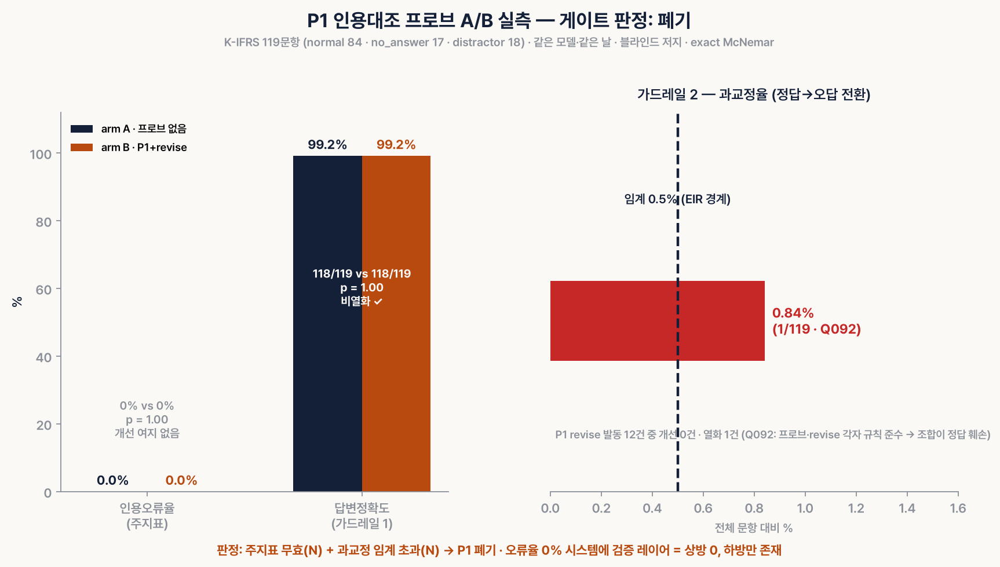

# probe-graph — Reflection Probe Verification Subgraph for Citation-Grounded QA

**English** | [한국어](README.md) | [中文](README.zh-CN.md)

This repository contains a **verification subgraph** skill that plugs into a
citation-grounded QA pipeline (a RAG bot), together with the complete **A/B
measurement harness** used to judge whether it actually helps.

The headline result first: **the main probe of this repository (P1) was
rejected by its own measurement gate.** The value here is not a "universal
verification prompt" but (1) three probes designed from the literature and
(2) the reproducible end-to-end **judgment procedure that filtered them out
before adoption** (pre-registration → blind grading → McNemar test).



## Why this exists (motivation)

The starting point was a paper from Anthropic's interpretability team:

> **"Verbalizable Representations Form a Global Workspace in Language Models"**
> (Anthropic, 2026, transformer-circuits.pub/2026/workspace)

The paper shows that LLMs contain a privileged set of representations that can
be put into words, and that **counterfactual reflection** — training a model so
that when you interrupt it and ask "what are you thinking right now?" it states
its principles — also improves actual behavior in the uninterrupted case. It
further reports a **BUT-gap** (88%): cases where the model internally registers
an objection but does not reflect it in its output.

The paper's core technique (J-lens) requires residual stream access, so API
users cannot apply it. This skill therefore translates only the causal finding —
"**what the model would say if asked is what it is silently reasoning**" — to
the prompt level: a design that inserts a **reflection probe** as a pipeline
node, asking after answer generation, "point out the parts of this answer you
cannot support with evidence."

## A naive implementation is harmful (design process)

Before implementing, we reviewed 8 papers on self-correction, and the
counter-evidence was consistent: **naive probes actually degrade performance.**

| Paper | What it contributed to this design |
|---|---|
| Huang et al., *Large Language Models Cannot Self-Correct Reasoning Yet* (arXiv:2310.01798) | "Assume the answer is wrong" prompts cost up to −9.5pp (CSQA). Correct→incorrect flips always outnumber incorrect→correct → anchors A1 ("presume the answer is likely already correct") and A5 ("confirm agreement, do not hunt for problems") |
| Dhuliawala et al., *Chain-of-Verification (CoVe)* (arXiv:2309.11495) | Factored verification (not showing the draft prose to the verifier) raised FACTSCORE 55.9→71.4. Yes/no verification questions induce sycophancy bias → P1 takes only the claim list as input, plus A6 (mandatory verbatim source excerpt) |
| FBC/EIR line of work (verify-first ablation) | Anchoring on "independent re-verification before editing + fix only concrete errors" moved EIR (correct→incorrect flips) from 2% to 0%, McNemar p<10⁻⁴. Under the same budget, 3-iteration refine (86.6) < Self-Consistency (93.4) → **revise loop cap = 1**, plus A2 and A3 |
| Madaan et al., *Self-Refine* (arXiv:2303.17651) | Failure analysis: 61% were "inappropriate edits" → A4 ("if unsupported, flag it only; do not replace it with different content") |
| Shinn et al., *Reflexion* (arXiv:2303.11366) | The limiting conditions of reflection driven by external signals |
| Manakul et al., *SelfCheckGPT* (arXiv:2303.08896) | The place of sampling-based self-checking — the basis for not adopting it here |
| Tian et al. (arXiv:2305.14975) · Xiong et al. (arXiv:2306.13063) | A single verbalized confidence number clusters in overconfidence (80–100%); top-2 verbalized confidence calibrates better → A7 (high/medium/low + two alternative candidates) |
| Obfuscation Atlas (FAR.AI, ICML 2026) | Making the count of probe flags a KPI does not produce honesty; it optimizes for evading the probe → the "do not optimize for flag count" rule |
| Morris et al., *How Much Do Language Models Memorize?* (ICML 2026) | A memorization limit of ~3.6 bits per parameter → pulling standard/article numbers from memory yields errors → no parametric citation; citations must go through verbatim RAG excerpts |

These grounds are baked into the probe prompts as **anchors A1–A7**
(`skill/references/probe-prompts.md` — includes a per-anchor table of source
figures).

### The three probes

| Probe | Edit authority | Over-correction risk | Use |
|---|---|---|---|
| P1 citation cross-check | Indirect (triggers revise, cap = 1) | Low (suppressed by anchors) | Batch answer verification |
| P2 verify-first | Itself | Empirically 0 (FBC) | System prompt for the real-time path |
| P3 risk enumeration | **None** | **Structurally 0** | Nightly audit, routing to humans |

## Measurement ① — synthetic stress test (QA of the probe itself)

We first verified that the probe "catches planted errors and does not force
spurious flags onto correct answers" (`harness/`). 5 correct answers + 5 answers
with planted errors (misquoted article numbers, altered figures, claims outside
the evidence).

- run1: 9.5/10 — **found 1 needs_revision logic inconsistency**: the model
  correctly assigned verdict='근거없음' ("unsupported") yet emitted needs_revision=false.
  → Lesson: **do not trust the model for verdict fields; derive them in code via
  `any(verdict != "일치")`** ("match") — the Korean literals match the actual
  probe output schema (reflected in the skill)
- run2 (after the fix): 5/5 errors localized, 0 spurious flags, 0 failures on
  verbatim quote existence, JSON 10/10 — pass

## Measurement ② — the A/B gate: and P1 failed it

**Pre-registration** (`ab/ab_questions_FROZEN.json`, frozen and not to be
modified): 119 questions built on 12 publicly available K-IFRS standards =
84 normal + 17 no_answer (hallucination bait) + 18 distractor (similar-paragraph
traps). The grading rules were fixed before the experiment as well.

**Execution**: same model, same day, arm A (no probe) vs arm B (P1 + revise).
Grading used (1) mechanical cross-checking of citation errors (the grader itself
validated against 6 negative controls) and (2) a **blind LLM judge** with the arm
labels hidden (presentation order shuffled too).

**Results** (full text: [`ab/AB_VERDICT.md`](ab/AB_VERDICT.md)):

| Gate | arm A | arm B | Verdict |
|---|---|---|---|
| Primary metric: citation error rate | 0/119 (0%) | 0/119 (0%) | p=1.0 — no room for improvement ❌ |
| Guardrail 1: answer accuracy | 99.2% | 99.2% | no degradation ✅ |
| Guardrail 2: over-correction rate | — | **0.84% > threshold 0.5%** | ❌ |

**Verdict: P1 rejected.** The single degradation case (Q092) is a live
reproduction of the EIR mechanism described in the literature — the probe, per
its rules, judged an "inference beyond the evidence" to be unsupported, and
revise, per its rules, hedged only that item; the result was an answer that
contradicted its own first sentence. It is an instance of **components that are
each individually correct combining to damage a correct answer**, exactly as in
the Self-Refine failure analysis (61% inappropriate edits).

### Lessons

1. **With a strong generation model and an evidence-attached structure, citation
   errors do not occur in the first place.** Even in the distractor traps, 0
   misattributions. If a verification layer has nothing to catch, the upside is 0
   and only the downside (over-correction) remains — not insurance, but pure cost.
2. Conditions under which adopting P1 is justified: environments where the
   generation model actually produces citation errors (weaker models, no attached
   evidence, reliance on parametric citation). **Measure your baseline error rate
   first; if it is 0%, do not attach P1.**
3. P3 (no edit authority) and P2 (verify-first anchors) are unaffected by this
   verdict — their over-correction is structurally 0 or empirically 0.
4. Without a judgment gate, we would have shipped a pure-cost layer to production
   on the reasoning that "we added verification, so it must be safer." **The most
   reusable part of this repository is not the probe but the gate.**

## A Pareto reading — clamping down on the harness is not optimal

Restated in one sentence, this experiment becomes an economics Pareto argument:
**verification strength is not a free dial but a movement between two competing
metrics (error detection ↔ over-correction).**

- arm A was already at (citation errors 0%, accuracy 99.2%) — a corner point on
  the frontier, with no axis left to improve.
- Adding a verification layer on top of that, arm B was a **Pareto-inferior
  move**: no metric went up (upside 0) and one metric went down
  (over-correction −0.84%).
- Q092 is a live instance of the deadweight loss of over-regulation — both the
  regulation (the probe) and the enforcement (revise) followed their own rules,
  yet the combined result was a net welfare loss.
- From this angle the identity of the McNemar gate is clear: **a device that
  detects a Pareto-inferior move before it is adopted.** The intuition "more
  verification is safer" is true only inside the frontier and false on it.

We state the limits of the claim as well: this measurement compares two points
on the verification-strength dial (no verification vs P1 + revise); it is not a
map of the whole frontier. The claim the data supports is not "we found the
optimum" but "**we empirically identified an inferior move**." Drawing the
frontier itself would require several levels of verification strength (e.g.,
P2 only / tuning P1 anchor strength / changing the revise threshold) and
measuring each point with the same gate.

## Domain portability — this is not K-IFRS-specific

The only thing in this repository tied to K-IFRS is the **measurement data (the
question set)**:

| Layer | Domain-dependent | Notes |
|---|---|---|
| Skill body (3 probes + anchors A1–A7 + graph structure) | No | A "claim ↔ verbatim evidence" cross-check structure — applicable to any citation QA with source documents (statutes, case law, internal policies, papers, contracts, medical guidelines) |
| Gate procedure (pre-registration → blind → McNemar) | No | The statistical procedure itself has no domain |
| Measurement data (`ab/ab_questions_FROZEN.json`, 119 questions) | K-IFRS | The author's operating domain simply happened to be accounting QA. Other domains substitute their own question sets |

The source literature behind the anchors comes from math (GSM8K), commonsense
(CSQA), and biography-writing (FACTSCORE) benchmarks, none of which relate to
accounting.

For the same reason, **the "P1 rejected" verdict is valid only within these
measurement conditions (K-IFRS + strong model + attached evidence)**. In other
domains, with weaker models, or without attached evidence, P1 may well be
effective — which is why the first step of the porting procedure is "measure the
baseline error rate in your own environment first," and this gate is the
automation of that judgment.

## Repository structure

```
skill/                  # Skill body (SKILL.md format for agent frameworks)
  SKILL.md              #   Graph structure, governing principles, measurement verdict record
  references/
    probe-prompts.md    #   Full text of the 3 probe prompts + per-anchor paper source figures
    evals.md            #   Binary quality gates (① self QA ② A/B gate)
harness/                # Measurement ①: synthetic stress test
  run_stress.py         #   Runner (separated from grading)
  cases.json            #   5 correct + 5 error-injected (based on synthetic evidence documents)
  evidence.md           #   Synthetic evidence document (not an actual standard)
  stress_results_run{1,2}.json
ab/                     # Measurement ②: A/B gate
  ab_questions_FROZEN.json  # 119 pre-registered questions (based on public K-IFRS standards)
  ab_runner.py          #   Two-arm runner (incremental saves, resumable)
  grade_ab.py           #   Mechanical grading + blind judge + McNemar report
  merge_verify.py       #   Independent re-verifier used during question generation
  make_chart.py         #   Verdict chart generation
  ab_grades.json        #   Raw grading data
  AB_VERDICT.md         #   Full verdict text
docs/
  ab_verdict_chart.png
```

## Reproduction

```bash
# Prerequisite: claude CLI (or replace run_llm() with the LLM call of your choice)
cd ab
python3 ab_runner.py            # Run both arms (incremental per-question saves, resumable)
python3 grade_ab.py mech        # Mechanical citation grading
python3 grade_ab.py judge       # Blind judge (~250 calls)
python3 grade_ab.py report      # McNemar verdict table
python3 make_chart.py           # Chart (requires matplotlib)
```

## References

- Anthropic (2026). *Verbalizable Representations Form a Global Workspace in Language Models.* transformer-circuits.pub/2026/workspace
- Huang, J. et al. (2023). *Large Language Models Cannot Self-Correct Reasoning Yet.* arXiv:2310.01798
- Dhuliawala, S. et al. (2023). *Chain-of-Verification Reduces Hallucination in Large Language Models.* arXiv:2309.11495
- Madaan, A. et al. (2023). *Self-Refine: Iterative Refinement with Self-Feedback.* arXiv:2303.17651
- Shinn, N. et al. (2023). *Reflexion: Language Agents with Verbal Reinforcement Learning.* arXiv:2303.11366
- Manakul, P. et al. (2023). *SelfCheckGPT: Zero-Resource Black-Box Hallucination Detection.* arXiv:2303.08896
- Tian, K. et al. (2023). *Just Ask for Calibration.* arXiv:2305.14975
- Xiong, M. et al. (2023). *Can LLMs Express Their Uncertainty?* arXiv:2306.13063
- FAR.AI (2026). *Obfuscation Atlas.* ICML 2026 — probe gaming / policy obfuscation
- Morris, J. et al. (2026). *How Much Do Language Models Memorize?* ICML 2026

## License and data provenance

- **Code, skill, and documentation: MIT** — free to use, modify, and redistribute
  with no domain restrictions.
- The bundled question set (`ab/ab_questions_FROZEN.json`) was generated solely
  from **publicly available paragraphs of Korean International Financial
  Reporting Standards (K-IFRS)** and contains no private or internal data. This
  is a data provenance notice, not a restriction on the skill's scope of
  application — see the "Domain portability" section above.
