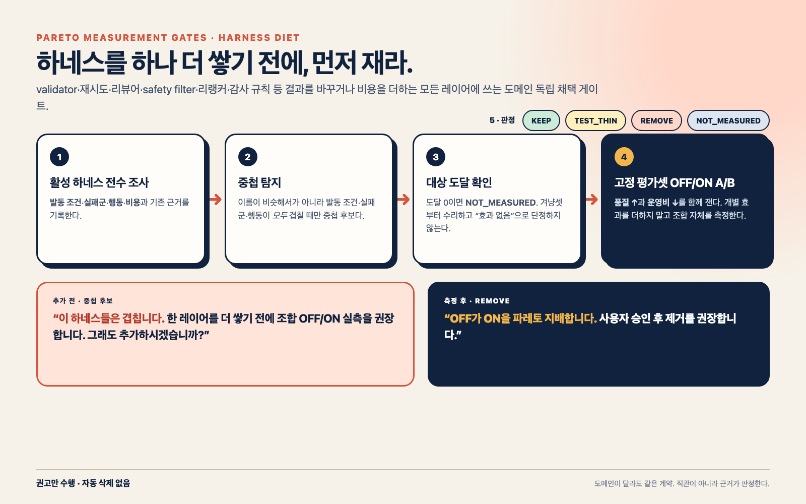
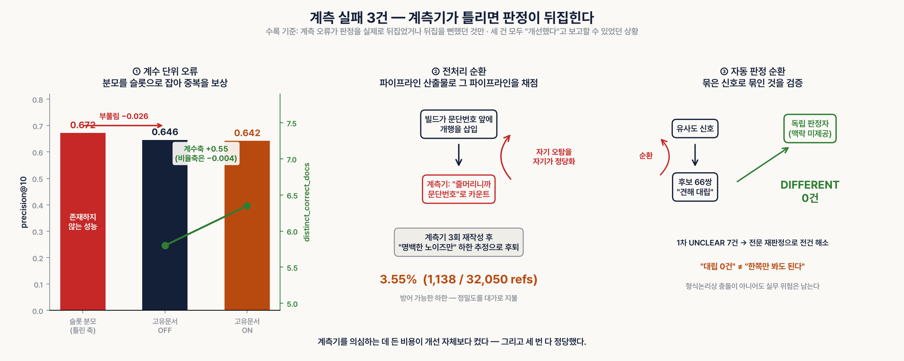

# pareto-measurement-gates — 자기개선을 채택할지 판정하는 게이트와 그 계측 규율

[English](README.en.md) | **한국어** | [中文](README.zh-CN.md)

> 📌 **2026-08 개명** — 구 `reflection-probe-gate` / `probe-graph`.
> 옛 URL은 GitHub 301 리다이렉트로 살아 있습니다. 리플렉션 프로브 실험(Phase 1~3)은
> 이 레포의 **출발점이자 한 챕터**이며, 현재 주제는 그 실험이 낳은
> **채택 게이트와 계측 규율**입니다.

인용 기반 QA 파이프라인의 검증 서브그래프 실험에서 출발했지만, 현재 핵심 산출물은
**도메인 독립 하네스 다이어트 게이트**입니다. validator·retry·reviewer·safety filter·
retrieval reranker·audit rule처럼 결과를 바꾸거나 비용을 더하는 모든 레이어에 적용합니다.

핵심이 되는 결과부터 밝힙니다: **본 레포의 메인 프로브(P1)는 자체 실측 게이트에서
폐기 판정을 받았습니다.** 이 레포의 가치는 "만능 검증 프롬프트"가 아니라,
①문헌 근거로 설계한 프로브 3종과 ②그것을 **채택하기 전에 걸러낸 판정 절차**
(사전 등록 → 블라인드 채점 → McNemar)의 재현 가능한 전 과정입니다.

그리고 그 이후 4단계(Phase 1~3 + 계기 검침)에서 게이트는 **자기 자신의 실패까지
잡아냈습니다.** 재사용 가치가 가장 높은 수치는 프로브가 아니라 게이트 쪽에 있습니다:

| 게이트 지표 | 실측값 | 의미 |
|---|---|---|
| 계기 검침 검출 회수율 | **81.8%** (9/11) | 측정 도구가 신호를 잡는지 본 실행 **전에** 확인 |
| 계기 검침 3판 재현성 | **SPLIT 0건** / 55 | 판정이 흔들리지 않음 |
| 옆방 검증 (영어·생의학 / 한국어·비회계) | **2/2 PASS**, recall 100% | 도메인·언어·라벨러를 바꿔도 절차가 작동 |
| 진단 비용 | **1,650콜 → 165콜** | 실패 원인 규명을 10분의 1 비용으로 |
| 프로브 3표 합의 (Phase 1) | 회수율 90% 유지, 검토부담 38.9%→35.2%, **자동 오탐 0** | 붙이지 않고 **걷어내서** 얻은 파레토 바깥이동 |


## 무엇에 쓰나 — 하네스를 더하는 게 아니라 덜어내기

검증·저지·재시도·감사 레이어를 계속 쌓으면 안전해 보이지만, baseline 오류가 이미 낮으면
상방은 없고 비용·지연·과교정만 생깁니다. 이 게이트는 레이어 OFF/ON을 **품질(높을수록 좋음)**과
**운영비(낮을수록 좋음)**에 놓고, 측정된 후보 중 파레토 최적 구성을 남깁니다.

이 `SKILL.md`를 로드한 에이전트는 먼저 활성 하네스의 `trigger / failure_domain / action / cost / evidence`를
inventory합니다. 발동 조건·실패군·행동이 겹치면 “한 레이어를 더 쌓기 전에 조합 OFF/ON 실측을
권장합니다. 그래도 추가하시겠습니까?”라고 알립니다. `REMOVE`가 나오면 “이 목적함수에는
부적합하므로 사용자 승인 후 제거·비활성화를 권장합니다”라고 말하며 **자동 삭제하지 않습니다.**



| 판정 | 뜻 | 실행 |
|---|---|---|
| `KEEP` | ON이 OFF를 지배 | 유지 |
| `REMOVE` | OFF가 ON을 지배 | 사용자 승인 후 제거·비활성화 |
| `TEST_THIN` | OFF와 ON이 모두 전선 | 실패군에만 ON인 조건부 후보를 측정 |
| `NOT_MEASURED` | 대상 도달 0 | 효과 없음 단정 금지; 겨냥셋 수리 |

```bash
python3 gate/harness_diet.py --off quality=.95,cost=10 --on quality=.95,cost=14
python3 gate/reach_check.py --demo
python3 gate/tests/test_field_validation.py
```

마지막 명령은 합성 예제가 아닙니다. **공개 A/B 원자료 119문은 직접 재집계**해 `REMOVE`를
재현하고, 비공개 원자료에서 기록된 필드 집계(도달 17/20·대상노출 36→21·전체 순서변동 13)는
정합성 replay로 `MOVED`를 확인합니다(필드 query-level 독립 재계산은 아님).
도달 분모의 형식화·식별 명제·한계는 [연구 노트](docs/TARGETING_REACH_NOTE.md),
여섯 번의 계측 실패는 [사례집](gate/MEASUREMENT_FAILURES.md)에 있습니다.

> 📖 이 레포가 만들어진 하루의 전 과정(설계 근거·4연속 실패·게이트가 저자의 오진을 잡은
> 기록)은 [케이스 스터디](docs/CASE_STUDY.md)에 순서대로 남겼습니다.
>
> 🧭 이 게이트를 실전 데이터에 일주일간 굴린 **필드 리포트**(계측 실패 3건·결손 계측·
> 메타하네스 4라운드 종합, 도식 8장): [`docs/field-report/FIELD_REPORT.md`](docs/field-report/FIELD_REPORT.md)

## 왜 만들었나 (동기)

출발점은 Anthropic 인터프리터빌리티 팀의 논문이었습니다:

> **"Verbalizable Representations Form a Global Workspace in Language Models"**
> (Anthropic, 2026, transformer-circuits.pub/2026/workspace)

이 논문은 LLM 내부에 "말로 꺼낼 수 있는 표현들의 특권 집합"이 있고, **counterfactual
reflection** — "중간에 끊고 '지금 무슨 생각해?'라고 물으면 원칙을 말하도록" 학습시키면
안 끊긴 상황의 실제 행동까지 개선된다는 것을 보였습니다. 또한 모델이 내부적으로는
이의를 인지하면서 출력에 반영하지 않는 **BUT-갭**(88%)을 보고했습니다.

논문의 본체 기법(J-lens)은 residual stream 접근이 필요해 API 사용자는 쓸 수 없습니다.
그래서 "**물어보면 말할 내용이 곧 조용히 추론하는 내용**"이라는 인과 발견만을
프롬프트 레벨로 번역한 것이 이 스킬입니다: 답변 생성 후 "이 답에서 근거 못 대는
부분을 말해봐"라고 묻는 **리플렉션 프로브**를 파이프라인 노드로 꽂는 설계.

> **범위 명시**: 이 레포는 위 논문의 **구현이 아닙니다.** 원 논문의 counterfactual
> reflection은 학습(fine-tuning) 기법이고, 이 레포는 추론 시 프롬프트 검증기입니다.
> 논문은 설계의 동기일 뿐, 본 레포 P1/P2/P3의 효과를 입증하지 않습니다 —
> 효과 판정은 전적으로 아래의 자체 A/B 게이트가 담당합니다.

## 순진하게 만들면 해롭다 (설계 과정)

구현 전에 자기검증(self-correction) 문헌 8편을 검토했고, **순진한 프로브는
오히려 성능을 깎는다**는 반대 증거가 일관되게 나왔습니다:

| 논문 | 이 설계에 준 것 |
|---|---|
| Huang et al., *Large Language Models Cannot Self-Correct Reasoning Yet* (arXiv:2310.01798) | "오답 가정" 프롬프트가 최대 −9.5pp (CSQA). 정답→오답 전환이 오답→정답보다 항상 많음 → 앵커 A1("이미 정확할 가능성이 높다고 전제") · A5("문제 찾기가 아니라 일치 확인") |
| Dhuliawala et al., *Chain-of-Verification (CoVe)* (arXiv:2309.11495) | factored 검증(초안 산문을 검증자에게 주지 않음)으로 FACTSCORE 55.9→71.4. yes/no 검증질문은 동조 편향 → P1은 주장 리스트만 입력 + A6(원문 발췌 강제) |
| FBC/EIR 계열 (verify-first ablation) | "수정 전 독립 재확인 + 구체적 오류만 수정" 앵커로 EIR(정답→오답) 2%→0%, McNemar p<10⁻⁴. 같은 예산에서 3-iter refine(86.6) < Self-Consistency(93.4) → **revise 루프 캡=1** · A2·A3 |
| Madaan et al., *Self-Refine* (arXiv:2303.17651) | 실패 분석: 61%가 "부적절 수정" → A4("근거 없으면 표시만, 다른 내용으로 바꾸지 마라") |
| Shinn et al., *Reflexion* (arXiv:2303.11366) | 외부 신호 기반 반성의 한계 조건 |
| Manakul et al., *SelfCheckGPT* (arXiv:2303.08896) | 샘플링 기반 자기점검의 위상 — 본 설계에서는 미채택 근거 |
| Tian et al. (arXiv:2305.14975) · Xiong et al. (arXiv:2306.13063) | 단일 숫자 확신도는 과확신 집중(80~100%), top-2 verbalized가 캘리브레이션 우수 → A7(상/중/하 + 대안 후보 2개) |
| Obfuscation Atlas (FAR.AI, ICML 2026) | 프로브 지적 건수를 KPI로 삼으면 정직해지는 게 아니라 프로브를 피하는 방향으로 최적화됨 → "지적 건수 최적화 금지" 규칙 |
| Morris et al., *How Much Do Language Models Memorize?* (ICML 2026) | 파라미터당 ~3.6비트 기억 한계 → 조문 번호를 기억에서 꺼내면 틀림 → 파라메트릭 인용 금지, 인용은 RAG 원문 발췌 경유 |

이 근거들이 프로브 프롬프트의 **앵커 A1~A7**로 박제되어 있습니다
(`skill/references/probe-prompts.md` — 앵커별 출처 수치 표 포함).

### 프로브 3종

| 프로브 | 수정 권한 | 과교정 위험 | 용도 |
|---|---|---|---|
| P1 인용대조 | 간접 (revise 트리거, 캡=1) | 낮음(앵커로 억제) | 배치 답변 검증 |
| P2 verify-first | 자기 자신 | 실증 0 (FBC) | 실시간 경로 시스템 프롬프트 |
| P3 위험열거 | **없음** | **구조적 0** | 야간 감사, 사람 라우팅 |

## 실측 ① — 합성 스트레스테스트 (프로브 자체 QA)

프로브가 "심은 오류를 잡고, 정상답에 억지 지적을 안 하는지"부터 검증했습니다
(`harness/`). 정상답 5 + 오류 심은 답 5 (조문 오기·수치 변조·근거 밖 주장).

- run1: 9.5/10 — **needs_revision 논리 불일치 1건 발견**: 모델이 verdict='근거없음'을
  정확히 잡고도 needs_revision=false로 출력. → 교훈: **판정 필드는 모델을 믿지 말고
  코드에서 `any(verdict != "일치")`로 유도**할 것 (스킬에 반영됨)
- run2 (수정 후): 오류 특정 5/5, 억지 지적 0, quote 원문 실존 0실패, JSON 10/10 — 통과

## 실측 ② — A/B 게이트: 그리고 P1은 떨어졌다

**사전 등록** (`ab/ab_questions_FROZEN.json`, 고정 후 수정 금지):
K-IFRS 공개 기준서 12종 기반 119문항 = normal 84 + no_answer 17(환각 유도)
+ distractor 18(유사 문단 함정). 채점 규칙도 실험 전 고정.

**실행**: 같은 모델·같은 날, arm A(프로브 없음) vs arm B(P1+revise).
채점은 ①인용오류 기계 대조(채점기 자체를 네거티브 컨트롤 6종으로 검증) +
②arm 라벨을 숨긴 **블라인드 LLM 저지** (제시 순서도 셔플).

**결과** (전문: [`ab/AB_VERDICT.md`](ab/AB_VERDICT.md)):

| 게이트 | arm A | arm B | 판정 |
|---|---|---|---|
| 주지표: 인용오류율 | 0/119 (0%) | 0/119 (0%) | p=1.0 — 개선 여지 없음 ❌ |
| 가드레일1: 답변정확도 | 99.2% | 99.2% | 비열화 ✅ |
| 가드레일2: 과교정율 | — | **0.84% > 임계 0.5%** | ❌ |

주지표 "0%"의 정확한 의미 (외부 리뷰 반영, 과대해석 방지):

- 기계 채점기는 인용 **구조·주소·발췌 실존**을 검사합니다 — 이 층에서 오류 0/238.
- "주장↔근거 의미 일치"는 별도 재채점으로 검증했습니다: 238건 전수를 claim 단위
  LLM 저지(`claude-sonnet-4-6`, fail-closed, 저지 원문·사유 전문 공개)로 재채점한 결과
  **의미상 상충 0건, 근거범위 초과 3/238(1.3%)** — A/B 완전 대칭이라 판정 불변.
  전문: [`gate/SEMANTIC_REGRADE.md`](gate/SEMANTIC_REGRADE.md)
- 의미상 상충 0/238의 95% CI 상한은 약 1.3%(rule of three)입니다.
  "오류율 0%"는 점 추정이며, 이 신뢰구간과 함께 읽어야 합니다.
- no_answer층 17문항(14.3%)은 양 arm 모두 정상 기권 — 환각 유도 실패 0.

**판정: P1 폐기.** 유일한 열화 사례(Q092)는 문헌의 EIR 메커니즘이 그대로 재현된
실물입니다 — 프로브는 규칙대로 "evidence 밖 추론"을 근거없음 판정했고, revise는
규칙대로 그 항목만 hedging으로 바꿨는데, 결과는 첫 문장과 모순되는 답이 됐습니다.
**구성 요소가 각자 옳아도 조합이 정답을 훼손할 수 있다**는 Self-Refine 실패 분석
(부적절 수정 61%)의 사례입니다.

### 교훈

1. **강한 생성 모델 + 근거 동봉 구조에서는 인용오류가 애초에 안 난다.**
   distractor 함정에서도 오인용 0건. 검증 레이어가 잡을 것이 없으면
   상방은 0이고 하방(과교정)만 남습니다 — 보험이 아니라 순비용.
2. P1 도입이 정당화되는 조건: 생성 모델이 인용오류를 실제로 내는 환경
   (더 약한 모델, 근거 미동봉, 파라메트릭 인용 의존). **먼저 baseline 오류율을
   재고, 0%면 P1을 붙이지 마세요.**
3. P3(수정 권한 없음)·P2(verify-first 앵커)는 이 판정의 영향을 받지 않습니다 —
   과교정이 구조적으로 0이거나 실증 0이기 때문.
4. 판정 게이트가 없었다면 "검증 붙였으니 더 안전하겠지"라며 순비용 레이어를
   프로덕션에 얹었을 것입니다. **이 레포에서 가장 재사용 가치가 높은 부분은
   프로브가 아니라 게이트입니다.**

## 파레토 관점 — 하네스를 꽉 잡는 것이 최적이 아니다

이 실험을 한 문장으로 옮기면 경제학의 파레토 개념이 됩니다:
**검증 강도는 공짜 다이얼이 아니라, 상충하는 두 지표(오류 적발 ↔ 과교정) 사이의
이동이다.**

- arm A는 이미 (인용오류 0%, 정확도 99.2%) — 개선할 여지가 있는 축이 없는,
  프런티어의 모서리점에 있었습니다.
- 거기에 검증 레이어를 얹은 arm B는 **파레토 열등 이동**이었습니다: 어떤 지표도
  오르지 않았고(상방 0), 한 지표만 내려갔습니다(과교정 −0.84%).
- Q092는 초과 규제의 사중손실(deadweight loss)의 실물입니다 — 규제(프로브)도
  집행(revise)도 각자 규칙을 지켰는데, 조합의 결과는 후생 순감소였습니다.
- 이 관점에서 McNemar 게이트의 정체는 명확합니다: **파레토 열등 이동을
  채택하기 전에 탐지하는 장치.** "검증을 더하면 더 안전하다"는 직관은
  프런티어 안쪽에서만 참이고, 프런티어 위에서는 거짓입니다.

주장 범위의 한계도 명시합니다: 본 실측은 검증 강도 다이얼의 두 점(무검증 vs
P1+revise) 비교이지 프런티어 전체 지도가 아닙니다. "최적점을 찾았다"가 아니라
"**열등 이동을 실측으로 판별했다**"까지가 이 데이터가 지지하는 주장입니다.
프런티어 자체를 그리려면 검증 강도를 여러 수준(예: P2만 / P1 앵커 강도 조절 /
revise 임계 변경)으로 두고 각 점을 같은 게이트로 재야 합니다.

## 실측 ③ — 그 뒤 4단계: 게이트가 자기 실패를 잡은 기록

A/B 판정 이후, "그럼 프로브가 잡은 오탐은 왜 났나"를 규명하려고 4단계를 더 돌렸습니다.
**세 번 연속 판정 불가**가 나왔고, 네 번째에서 원인이 특정됐습니다. 이 절이 이 레포에서
가장 재사용 가치가 높은 부분입니다 — 실패의 종류가 매번 달랐기 때문입니다.

| 단계 | 무엇을 물었나 | 결과 | 안 잰 것 |
|---|---|---|---|
| Phase 1 | 프로브가 문제를 잡는가 | 판정 불가 | 프로브 판정의 **재현성** |
| Phase 2 | 표본을 늘리면 판정되는가 | 판정 불가 | 사람 라벨 **기저율** (3.3%) |
| Phase 3 | 채점 단위가 판정을 왜곡하는가 | 판정 불가 | 저지 판정 **기저율** (0%) |
| 계기 검침 | **측정 도구는 멀쩡한가** | **PASS** | — |

### Phase 1 — 재현성이 없다는 발견

동일 프롬프트·동일 모델로 저지를 3회 실행하자 54건 중 5건이 매번 달라졌습니다.
즉 **단일 실행 수치를 성능으로 보고하면 허위보고**입니다. 이후 모든 채점을 3판
다수결로 고정했습니다.

이 규율에서 파레토 바깥이동이 나왔습니다. 프로브 판정을 1표에서 **3표 합의**로 바꾸자:

- 회수율 90.0% → 90.0% (**손실 0**)
- 사람 검토 부담 38.9% → **35.2%**
- 자동 구간 오탐 0건 유지

지표를 **더 붙여서**가 아니라 **불안정분을 걷어내서** 얻은 개선입니다.

### Phase 2 — 기저율이 표본 크기를 이긴다

사람 라벨을 늘려 검정력을 확보하려 했습니다. 내부 파일럿(internal pilot) 설계로
30건을 라벨해 **기저율만** 읽었더니 **3.3%(1/30)**. 후보 풀 201건을 전량 라벨해도
기대 문제 사례가 6.7건으로 목표 55건에 못 미쳤습니다.

→ **171건을 라벨하지 않고 종결**했습니다. 원안 완주는 파레토 열등이기 때문입니다.
파일럿은 폐기하지 않고 본 표본에 중첩(nested)시켜 optional stopping 비판을 피했습니다.

### Phase 3 — 1,650콜을 태우고 검정 불가

결과변수를 사람 라벨에서 **저지 판정의 뒤집힘**으로 바꿔 사람 비용을 0으로 만들었습니다.
형제 주장 문맥의 유무만 바꾸는 단일 변인 A/B, 조건별 3판, 총 1,650콜.

결과: **조건 A(대조)의 문제 판정이 271건 중 0건.** 뒤집힐 대상이 없어 가설이
검정되지 않았습니다. 관측된 불일치 6건은 전부 반대 방향(엄격해짐)이었고
McNemar p=0.125로 유의하지 않았습니다.

### 계기 검침 — 165콜로 원인을 특정하다

여기서 두 가설이 갈렸고, 처방이 정반대였습니다:

- **가설 I (계기 고장)**: 저지가 문제를 검출하지 못하는 구성이다 → 저지를 고쳐야 함
- **가설 C (코퍼스 공백)**: 저지는 정상이고 표본에 문제가 없었다 → 표본을 바꿔야 함

프롬프트 코드를 대조하니 가설 I가 유력해 보였습니다. Phase 3 저지에는 Phase 1의
검증된 저지에 있던 `[전체 답변]` 블록과 "규칙의 왜곡" 지침이 **없었습니다.**

그래서 고치기 전에 **쟀습니다.** Phase 3 저지 프롬프트를 한 글자도 바꾸지 않고
(빌더를 그대로 import) 사람 라벨 55건에 적용했습니다. 판정 기준과 채점기는
결과를 보기 **전에** 커밋했습니다.

| 항목 | 값 |
|---|---|
| 사람 판정 문제 11건 중 검출 | **9건** |
| 검출 회수율 | **81.8%** Wilson 95% [52.3%, 94.9%] |
| CONTRADICTED 검출 | 7건 |
| 3판 SPLIT | **0건** |

**PASS — 가설 I는 기각됐습니다. 저자의 진단이 틀렸습니다.**
지침이 없어도 저지는 잘 잡았고, 오히려 3판 재현성은 Phase 1의 복잡한 저지(5건 흔들림)보다
좋았습니다(0건). 검침 없이 진단대로 고쳤다면 **멀쩡한 도구를 고치고 그것을 개선이라고
보고했을 것입니다.**

### 🔴 진짜 원인 — 두 규율이 충돌한다

원인은 표본에 있었고, 그 출처가 사전등록 규칙 자체였습니다.

Phase 3는 순환 논증을 피하려고 "가설을 생성한 표본은 확증 집합에서 제외한다"는
규칙을 뒀습니다. 실측해 보니 **문제가 발견된 28문항이 확증 집합에 0개, 제외 집합에
28개 전부** 들어가 있었습니다.

> **순환 논증을 피하려고 가설 생성 표본을 제외하면, 신호도 함께 제외된다.**
> 제외하지 않으면 순환이고, 제외하면 검정 대상이 사라진다.

이것은 부주의가 아니라 **사전등록 규율을 성실히 따른 결과**입니다. 두 규율
(순환 차단 ↔ 검정 가능성)이 서로 충돌한 사례입니다.

해법은 제외를 포기하는 것이 아니라, **제외한 뒤에도 결과변수의 기저율이 남는지를
본 실행 전에 확인**하는 것입니다. 그것이 계기 검침이고, 비용은 본 실행의 10분의 1입니다.

### 이 4단계에서 가져갈 규칙 3개

1. **검정력은 표본 크기가 아니라 결과변수의 기저율에 대해 계산한다.**
   "N=264건 확보"는 분모일 뿐입니다. 그중 몇 건이 문제로 판정될지가 분자이고,
   분자가 0이면 어떤 N으로도 검정할 수 없습니다.
2. **측정 도구를 고치기 전에 도구가 신호를 잡는지부터 잰다.**
   코드 대조는 그럴듯한 가설을 주지만 판정이 아닙니다. 이 레포에서는 그 가설이
   실제로 틀렸습니다.
3. **단일 실행 수치를 성능으로 보고하지 않는다.** 저지 판정은 재현되지 않습니다.

전문: [`gate/PHASE1_VERDICT.md`](gate/PHASE1_VERDICT.md) ·
[`gate/PHASE2_VERDICT.md`](gate/PHASE2_VERDICT.md) ·
[`gate/PHASE3_VERDICT.md`](gate/PHASE3_VERDICT.md) ·
[`gate/INSTRUMENT_CHECK_RESULT.md`](gate/INSTRUMENT_CHECK_RESULT.md)

각 단계의 사전 선언 문서(`*_PREREGISTRATION.md`, `INSTRUMENT_CHECK_PREREG.md`)는
전부 **실행 전 커밋**되어 있으며, 커밋 순서가 git 이력으로 검증 가능합니다.

## 도메인 이식성 — K-IFRS 전용이 아닙니다

이 레포에서 K-IFRS에 종속된 것은 **실측 데이터(문항 세트)뿐**입니다:

| 층 | 도메인 종속 | 비고 |
|---|---|---|
| 스킬 본체 (프로브 3종 + 앵커 A1~A7 + 그래프 구조) | 없음 | "주장 ↔ 근거 원문 대조" 구조 — 근거 문서가 있는 인용 QA면 어디든 (법령·판례·사내 규정·논문·계약서·의료 가이드라인) |
| 게이트 절차 (사전 등록 → 블라인드 → McNemar) | 없음 | 통계 절차 자체에 도메인이 없음 |
| 실측 데이터 (`ab/ab_questions_FROZEN.json` 119문항) | K-IFRS | 저자의 운영 도메인이 회계 QA였을 뿐. 다른 도메인은 자기 문항 세트로 교체 |

앵커의 근거 문헌들 자체가 수학(GSM8K)·상식(CSQA)·전기 작성(FACTSCORE) 벤치마크에서
나온 것으로, 회계와 무관합니다.

### 실측: 옆방 두 곳에서 검증했습니다 (2026-07-28)

이전 판 README는 이 절을 **"미검증(unverified)"** 으로 표기했습니다. 설계 주장만
있고 실측이 없었기 때문입니다. 그 표기를 아래 실측으로 교체합니다.

**계기 검침 절차를 도메인·언어·라벨러가 다른 두 데이터셋에 그대로 적용**했습니다.
판정기 프롬프트는 한 글자도 고치지 않았고(빌더를 import), 임계도 원래 방과
동일하게 유지했습니다. 사전 선언은 실행 전 커밋했습니다.

| 방 | 언어 | 도메인 | 라벨러 | recall | SPLIT | 판정 |
|---|---|---|---|---|---|---|
| 원래 방 (K-IFRS) | 한국어 | 회계 기준 | 저자 | 81.8% (9/11) | 0 | **PASS** |
| 옆방 1 ([SciFact](https://arxiv.org/abs/2004.14500)) | **영어** | **생의학** | **외부** | 100% (22/22) | 0 | **PASS** |
| 옆방 2 ([KLUE-NLI](https://arxiv.org/abs/2105.09680)) | 한국어 | **비회계** | **외부** | 100% (22/22) | 0 | **PASS** |

**라벨러가 외부인 두 방에서도 PASS**가 나온 것이 중요합니다. 원래 방은 저자가
라벨하고 저자가 만든 판정기를 검침했으므로 기준이 무의식적으로 정렬됐을 가능성이
있었는데, 그 설명은 지지되지 않았습니다.

#### 🔴 그리고 축이 갈렸습니다 — 회수율은 언어에 둔감, 정밀도는 민감

옆방 1만으로는 언어·도메인·라벨러가 동시에 바뀌어 원인 귀속이 불가능했습니다.
옆방 2가 **언어를 한국어로 고정**하면서 분리됐습니다.

| 지표 | SciFact (en) | KLUE-NLI (ko) |
|---|---|---|
| 검출 회수율 (게이트 지표) | 100% | 100% |
| 3라벨 완전일치 | 72.7% | **92.7%** |
| 오탐 (사람 S → 문제 판정) | **36.4%** | **3.0%** |
| 정밀도 (게이트 밖 참고) | 64.7% | 95.7% |

문제를 **놓치는** 실패는 두 언어 모두 0이었고, 문제가 **아닌 것을 문제라고 하는**
실패는 영어에서 12배 늘었습니다. 한국어 프롬프트 + 영문 근거 조건에서 판정기가
"근거 범위 밖"을 더 자주 선언한 것입니다.

**어느 쪽이 옳은지는 이 실험이 답하지 못합니다** — 판정기가 더 엄격한 것일 수도,
교차언어 조건에서 근거 이해가 얕아진 것일 수도 있습니다. 구별하려면 프롬프트를
영어로 번역한 조건이 필요하고, 그것은 변인을 하나 더 바꾸므로 별도 실험으로 남깁니다.

#### 여전히 주장하지 않는 것

- **"모든 도메인에서 된다"가 아닙니다.** 검증된 것은 3개 도메인입니다.
- **모델 간 이식성은 미검증**입니다. 판정기는 여전히 `claude-sonnet-4-6` 하나입니다.
- 옆방 2(NLI)는 함의 판정 과제로, 인용 검증과 과제 성격이 다릅니다.

전문: [`gate/SIDECHECK_PREREG.md`](gate/SIDECHECK_PREREG.md) (사전 선언) ·
[`gate/SIDECHECK_RESULT.md`](gate/SIDECHECK_RESULT.md) (결과)

같은 이유로 **"P1 폐기" 판정의 유효 범위도 이 실측 조건(K-IFRS + 강한 모델 + 근거
동봉)에 한정**됩니다. 다른 도메인·더 약한 모델·근거 미동봉 환경에서는 P1이 유효할 수
있습니다 — 그래서 이식 절차의 첫 단계가 "자기 환경의 baseline 오류율을 먼저 재라"이고,
그 판정을 자동화한 것이 이 게이트입니다.

### 기존 하네스에는 정말 채택 게이트가 없는가

"채택 게이트가 필요하다"는 주장은, 기존 구현에 그것이 없다는 실측이 있어야 성립합니다.
공개 참조 구현 1종(`PrimeIntellect-ai/prime-agent`, 커밋 `a18809e`)을 파일:라인 단위로
해부했습니다.

- **형식은 코드가 강제**합니다 — 스키마 위반·동시 수정 충돌은 확실히 거부됩니다.
- **개선 여부 판정은 위임**돼 있습니다 — `shouldRefine === true` 부울 한 줄이고,
  제안이 함께 저장하는 `expectedOutcome`을 읽는 곳은 **다음 프롬프트 렌더링 1곳뿐**입니다.
  즉 자기개선이 누적되되 그것이 개선인지 재는 코드 경로가 없습니다.
- 반대로 **동시성 안전장치는 이 레포에 없는 수준**으로 구현돼 있습니다(세대번호 무효화,
  적용 직전 baseline 대조, 원자적 저장). 두 구현은 서로 다른 축을 지키고 있습니다.

같은 문서에 **우리가 낸 부재증명 오류 1건과 그 교정 과정**도 그대로 남겼습니다 —
잘못된 파일 경로로 grep한 결과를 "0건"으로 읽었고, 재실행에서 깨졌습니다.
부재증명은 재현되지 않으면 증거가 아닙니다.

전문: [`gate/RELATED_HARNESSES.md`](gate/RELATED_HARNESSES.md)

### 이것은 새 문제가 아니다 — 축차추정·가지치기와의 대응

반복 갱신되는 추정기에 **이득(gain)**을 두는 것, 뻗기 전에 유의성을 먼저 묻는 것은
이미 이름이 붙은 처방입니다.

- **축차 최소자승(RLS)의 이득 `K`가 채택 게이트 자리**입니다. 참조 구현은 사실상
  `K = 1` 고정(제안이면 그대로 적용)이고, 이 레포는 그 자리에 파레토 판정을 놓습니다.
- **자기회귀 모델의 노출 편향**이 그대로 재현됩니다 — 자기가 쓴 스킬을 다음 세션이
  다시 읽으므로, ground truth 재주입(정기 검증)이 없으면 드리프트가 원리적으로
  안 막힙니다.
- **결정트리의 사전 가지치기**가 계기 검침과 같은 구조입니다. 실제로 330콜 검침이
  1,650콜 탐색을 시작 전에 차단했습니다. 동시에 사전 가지치기의 알려진 약점
  (horizon effect)도 그대로 물려받습니다.

🔴 다만 **RLS가 전제하는 선형성·볼록성·수렴보장은 하네스에 하나도 성립하지 않습니다.**
특히 RLS의 이득은 공분산에서 *계산*되는데 우리에겐 그 공분산이 없어, 사전 등록된
판정 규칙으로 대체돼 있습니다. 대응이 끊기는 지점과 쓰지 않기로 한 유추까지
같은 문서에 적었습니다.

전문: [`gate/THEORY_MAPPING.md`](gate/THEORY_MAPPING.md)

### 계측기가 틀리면 판정이 뒤집힌다 — 실패 사례 6건



게이트를 아무리 잘 설계해도 **게이트가 읽는 숫자가 틀리면** 판정은 무의미합니다.
운영 중인 인용 QA 파이프라인과 그 평가 하네스에서 실제로 판정을 뒤집었던(또는
뒤집을 뻔했던) 계측 실패 6건을 수록했습니다.

- **계수 단위 오류** — `precision`의 분모를 슬롯으로 잡아 중복 정답을 이중 계수.
  보고값 0.672는 존재하지 않는 성능이었고, 이 부풀림이 정당한 개선을 **DOMINATED로
  오판**시켰습니다. 고유문서 기준으로 고치니 비율축은 −0.004(사실상 0)인데
  절대 계수축이 5.80 → 6.35로 움직였습니다 — **비율축은 중복제거를 볼 수 없습니다.**
- **전처리 순환** — 빌드가 삽입한 개행을 계측기가 "줄머리니 문단번호"로 세어
  자기 오탐을 자기가 정당화. 계측기를 **3번 다시 썼고**, 최종적으로 "명백한 노이즈만
  세는 하한 추정"으로 후퇴해 방어 가능한 수치(3.55%)를 얻었습니다.
- **자동 판정 순환** — 후보를 묶은 신호로 그 후보를 검증하던 구조. 맥락을 주지 않는
  독립 판정자로 66쌍 전수 재판정 → **DIFFERENT 0건**(자동 추출된 "대립"은 실재하지
  않았음). 1차 UNCLEAR 7건까지 전문 재판정으로 해소한 뒤에야 확정했습니다.
- **기준선 위조** — A/B의 baseline 팔이 운영 진입점이 아니라 헬퍼 함수를 빌린
  재현물이었고, 실험 5회분이 존재하지 않는 시스템과의 비교였습니다. 운영 진입점
  실측은 재현물의 **3.1배**였고, 재려던 개입은 이미 배선돼 있었습니다.
- **채점 단위 오류** — gold가 한 코퍼스의 경로 기준이라 정답을 짚어도 0점(내용
  식별자로 조인해야 성립), 같은 답변이 입도에 따라 0.244 ↔ **0.750**으로
  갈렸습니다. 이 오판 위에서 "개선안" 여러 종이 발주·전부 기각됐습니다.
- **겨냥 실패의 위장** — 가드 고장을 고쳐 대상이 0 → 137,024건이 됐는데 프로덕션
  A/B는 전 지표 ±0·순서변동 0. 겨냥 질의셋에서도 0 → 0이 나왔지만, seed를 전체
  풀에서 뽑아 **대상에 닿지도 않은 것**이었습니다. 도달 분모를 출력하자 36 → 21로
  갈렸고, 그 변화가 안전 프록시의 기계적 효과일 뿐 품질 개선이 아님도 함께 남겼습니다.

여섯 사례의 공통점은 **전부 계측기가 틀린 판정을 먼저 확정할 뻔한 상황**이라는
점입니다. 계측기를 의심하는 비용이 개선 자체보다 컸지만, 여섯 번 다 정당했습니다.

전문: [`gate/MEASUREMENT_FAILURES.md`](gate/MEASUREMENT_FAILURES.md)

## 레포 구조

```
skill/                  # 스킬 본문 (에이전트 프레임워크용 SKILL.md 포맷)
  SKILL.md              #   그래프 구조·대원칙·실측 판정 기록
  references/
    probe-prompts.md    #   프로브 프롬프트 전문 3종 + 앵커별 논문 출처 수치
    evals.md            #   이진 품질 게이트 (①자체 QA ②A/B 게이트)
skill-pareto/           # 파레토 채택 게이트 스킬 (이 실험이 운영화한 판정 절차)
  SKILL.md              #   열등이동/바깥이동 판정 규칙 + 적용 지도
harness/                # 실측 ① 합성 스트레스테스트
  run_stress.py         #   러너 (채점과 분리)
  cases.json            #   정상 5 + 오류 주입 5 (합성 근거 문서 기반)
  evidence.md           #   합성 근거 문서 (실제 기준서 아님)
  stress_results_run{1,2}.json
ab/                     # 실측 ② A/B 게이트
  ab_questions_FROZEN.json  # 사전 등록 문항 119 (K-IFRS 공개 기준서 기반)
  ab_results.json       #   두 arm 원시 출력 전문 (감사·재채점용)
  ab_runner.py          #   두 arm 러너 (증분 저장·재개 가능)
  grade_ab.py           #   기계 채점 + 블라인드 저지 + McNemar 리포트
  merge_verify.py       #   문항 생성 시 독립 재검증기
  make_chart.py         #   판정 차트 생성
  ab_grades.json        #   채점 원자료
  AB_VERDICT.md         #   판정 전문
gate/                   # 채점 게이트 패키지 + 의미 레이어 재채점 + Phase 1~3 실측
  src/reflection_gate/  #   결정론(구조·주소·발췌)+의미(LLM 저지) 2층 채점기, fail-closed
  tests/                #   pytest 75종 (uv 격리환경 전수 PASS; 네거티브 컨트롤 포함)
  SEMANTIC_REGRADE.md   #   238건 전수 재채점 판정 (FLAGGED 18건 사람 대조 포함)
  LABELING_PROTOCOL.md  #   사람 라벨 프로토콜 (라벨 시작 전 커밋)
  PHASE1_VERDICT.md     #   Phase 1 판정 — 재현성 없음 발견, 3표 합의 채택
  PHASE2_INTERNAL_PILOT.md  # 내부 파일럿 설계 (기저율만 열람, 중첩 표본)
  PHASE2_PILOT_RESULT.md    # 파일럿 실측 — 기저율 3.3%
  PHASE2_VERDICT.md     #   Phase 2 판정 — 표본 부족, 171건 라벨 안 하고 종결
  PHASE3_PREREGISTRATION.md # Phase 3 사전 선언 (실행 전 커밋, McNemar 임계 정정 기록)
  PHASE3_VERDICT.md     #   Phase 3 판정 — 검정 불가 + 원인(순환 차단이 신호 제거)
  PHASE4_PREREGISTRATION.md # Phase 4 사전 선언 DRAFT (Phase 3 결과 열람 전 작성)
  INSTRUMENT_CHECK_PREREG.md   # 계기 검침 사전 선언 (실행 전 커밋)
  INSTRUMENT_CHECK_RESULT.md   # 계기 검침 결과 — PASS, 저자 진단이 틀렸음을 기록
  SIDECHECK_PREREG.md   #   옆방 검증 사전 선언 (§8은 옆방1 결과 열람 전 커밋)
  SIDECHECK_RESULT.md   #   옆방 2곳 결과 — 둘 다 PASS, 회수율↔정밀도 축 분리
  RELATED_HARNESSES.md  #   참조 구현 해부 — 채택 게이트 부재 실측 (부재증명 오류 1건 포함)
  THEORY_MAPPING.md     #   RLS·자기회귀·가지치기 대응 + 대응이 끊기는 지점
  MEASUREMENT_FAILURES.md #  계측 실패 6건 — 계수단위·전처리순환·판정순환·기준선위조·채점단위·겨냥실패
  harness_diet.py       #   OFF/ON 순편익 → KEEP·REMOVE·TEST_THIN 판정
  reach_check.py        #   겨냥 실패와 순효과 0을 도달 분모로 분리
  fixtures/             #   2026-08-28 운영 실측 집계 (필드 회귀검증)
  scripts/              #   각 Phase 러너·채점기·원자료 (판정기는 결과 열람 전 커밋)
docs/
  TARGETING_REACH_NOTE.md # 도달 분모 식별 명제·운영 실측·하네스 다이어트 연구 노트
  ab_verdict_chart.png
  pareto_chart.png      #   파레토 3패널 (열등이동·바깥이동·축 분리)
  failure_ladder.png    #   4단계가 매번 다른 층에서 실패한 구조
  gate_flow.png         #   사전등록 게이트 5단계
  measurement_failures.png # 계측 실패 도식 — 사례 1~3 (수치는 문서에서 파싱 — 하드코딩 없음)
  CASE_STUDY.md         #   케이스 스터디 — 개발 하루 전 과정 (한/영/중)
STATE.md                # 다세션 상태 다이제스트 (결정 누적·막힘·검증 게이트)
```

## 재현

```bash
# 전제: claude CLI (또는 run_llm()을 원하는 LLM 호출로 교체)
cd ab
python3 ab_runner.py            # 두 arm 실행 (문항별 증분 저장, 중단 후 재개 가능)
python3 grade_ab.py mech        # 기계 인용 채점
python3 grade_ab.py judge       # 블라인드 저지 (~250콜)
python3 grade_ab.py report      # McNemar 판정표
python3 make_chart.py           # 차트 (matplotlib 필요)
```

### 계기 검침 재현 (권장 진입점)

이 레포에서 **가장 먼저 돌려볼 가치가 있는 것**은 계기 검침입니다.
자기 환경의 검증기가 신호를 잡는지 165콜로 확인합니다.

```bash
cd gate
for r in run1 run2 run3; do
  .venv/bin/python scripts/instrument_check_run.py $r
done
.venv/bin/python scripts/instrument_check_score.py   # 사전 선언 기준 자동 적용
```

판정은 `INSTRUMENT_CHECK_PREREG.md` §4의 임계(recall ≥ 30%)로 자동 산출됩니다.
**FAIL이면 본 실험을 시작하지 마세요** — 도구가 신호를 못 잡는 상태에서 얻은
"효과 없음"은 처치의 실패가 아니라 측정의 실패입니다.

다른 도메인에 이식하려면 `instrument_check_run.py`의 `load_units()`가 읽는
라벨 시트(id / question / evidence / claim_text / 사람 라벨 S·C·I)만 교체하면 됩니다.

### 옆방 검증 재현 (도메인 이식성)

동일 절차를 공개 데이터셋 두 곳에 적용한 실측입니다. 원본 데이터는 재배포하지
않으며 스크립트가 각 출처에서 직접 받습니다.

```bash
cd gate
.venv/bin/python scripts/sidecheck_fetch.py          # SciFact (CC BY-NC 2.0)
.venv/bin/python scripts/sidecheck_build_units.py    # 층화 55건, seed 고정
.venv/bin/python scripts/sidecheck2_build_units.py   # KLUE-NLI (CC BY-SA 4.0)
for r in run1 run2 run3; do
  .venv/bin/python scripts/sidecheck_run.py $r --room 1
  .venv/bin/python scripts/sidecheck_run.py $r --room 2
done
.venv/bin/python scripts/sidecheck_score.py --room 1
.venv/bin/python scripts/sidecheck_score.py --room 2
```

## 참고문헌

- Anthropic (2026). *Verbalizable Representations Form a Global Workspace in Language Models.* transformer-circuits.pub/2026/workspace
- Huang, J. et al. (2023). *Large Language Models Cannot Self-Correct Reasoning Yet.* arXiv:2310.01798
- Dhuliawala, S. et al. (2023). *Chain-of-Verification Reduces Hallucination in Large Language Models.* arXiv:2309.11495
- Madaan, A. et al. (2023). *Self-Refine: Iterative Refinement with Self-Feedback.* arXiv:2303.17651
- Shinn, N. et al. (2023). *Reflexion: Language Agents with Verbal Reinforcement Learning.* arXiv:2303.11366
- Manakul, P. et al. (2023). *SelfCheckGPT: Zero-Resource Black-Box Hallucination Detection.* arXiv:2303.08896
- Tian, K. et al. (2023). *Just Ask for Calibration.* arXiv:2305.14975
- Xiong, M. et al. (2023). *Can LLMs Express Their Uncertainty?* arXiv:2306.13063
- FAR.AI (2026). *Obfuscation Atlas.* ICML 2026 — 프로브 게이밍/정책 난독화
- Morris, J. et al. (2026). *How Much Do Language Models Memorize?* ICML 2026
- Wadden, D. et al. (2020). *Fact or Fiction: Verifying Scientific Claims.* EMNLP 2020, arXiv:2004.14500 — 옆방 검증 1 (SciFact)
- Park, S. et al. (2021). *KLUE: Korean Language Understanding Evaluation.* NeurIPS 2021 D&B, arXiv:2105.09680 — 옆방 검증 2 (KLUE-NLI)

### 참조 구현 (§"기존 하네스에는 정말 채택 게이트가 없는가")

- PrimeIntellect-ai. *prime-agent.* github.com/PrimeIntellect-ai/prime-agent —
  해부 대상, 커밋 `a18809e` 고정. 파일:라인 인용과 재현 명령은
  [`gate/RELATED_HARNESSES.md`](gate/RELATED_HARNESSES.md)

### 이론 대응 (§"이것은 새 문제가 아니다")

이 절의 대응은 **구조의 대응이지 정리의 이식이 아니다.** 각 항목이 전제하는 조건과
그것이 하네스에서 성립하지 않는 지점은 [`gate/THEORY_MAPPING.md`](gate/THEORY_MAPPING.md) §4.

- Åström, K. J. & Wittenmark, B. (1994). *Adaptive Control* (2nd ed.), Addison-Wesley —
  RLS 이득 `K`와 망각인자 `λ`. 채택 게이트를 이득 자리에 대응시키는 근거
- Ljung, L. (1999). *System Identification: Theory for the User* (2nd ed.), Prentice Hall —
  축차추정의 공분산 `P`와 이득 계산. **우리에게 없는 것이 바로 이 `P`다**
- Bengio, S. et al. (2015). *Scheduled Sampling for Sequence Prediction with
  Recurrent Neural Networks.* NeurIPS 2015, arXiv:1506.03099 — 노출 편향과
  teacher forcing. 하네스에서 "자기가 쓴 스킬의 재입력"에 대응
- Breiman, L. et al. (1984). *Classification and Regression Trees.* Wadsworth —
  사전/사후 가지치기. 계기 검침이 사전 가지치기에 해당
- Quinlan, J. R. (1987). *Simplifying Decision Trees.* Int. J. Man-Machine Studies 27(3) —
  사전 가지치기의 horizon effect. 우리 IC-1 FAIL 해석의 위험을 그대로 물려받는다

### 메타하네스 문헌 대조 (결정 15)

front를 부모 선택 규칙으로 쓰는 사례를 찾기 위한 6소스 대조. 요지는
"자기개선 계층에는 없고, 타 도메인(수식 발견·라우팅)에만 부분적으로 있다"이며
표는 [`gate/PARETO_META_HARNESS_DESIGN.md`](gate/PARETO_META_HARNESS_DESIGN.md) §2.
🔴 그중 TRACE-Router가 남긴 경고 — **front 점유 주장에는 무작위 혼합 대조군이
필요하다**("random mixture also traces the line segment").

## 라이선스와 데이터 출처

- **코드·스킬·문서: MIT** — 도메인 제한 없이 자유롭게 사용·수정·재배포 가능합니다.
- **동봉 문항 세트**(`ab/ab_questions_FROZEN.json`)는 한국채택국제회계기준(K-IFRS)
  **공개 기준서 문단**만을 근거로 생성했으며, 어떤 사적/내부 데이터도 포함하지
  않습니다. 이는 데이터 출처 고지일 뿐 스킬의 적용 범위 제한이 아닙니다 —
  위 "도메인 이식성" 절 참조.
