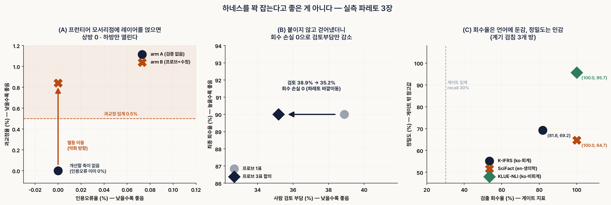
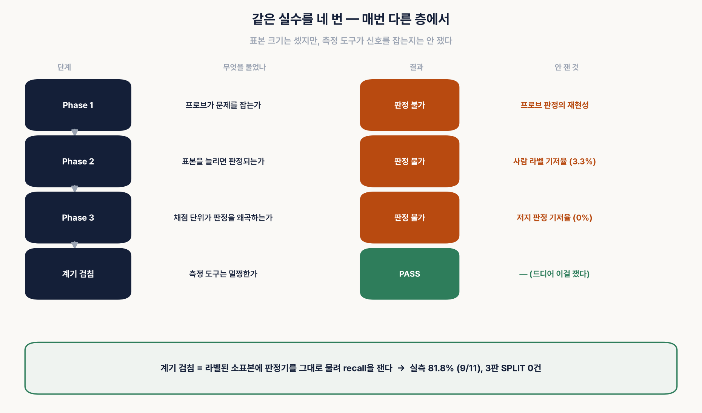
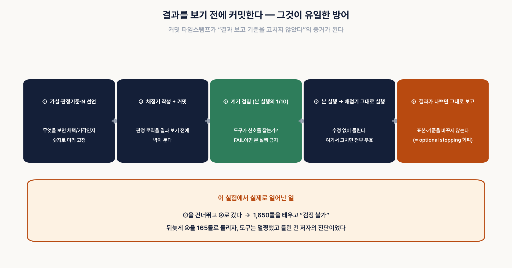

# 案例研究 —— 帕累托：把护栏(harness)拧得越紧未必越好

[English](CASE_STUDY.en.md) | [한국어](CASE_STUDY.md) | **中文**

> 这是本仓库诞生那一天的开发记录。按时间顺序留下了设计依据、失败与判定过程，
> 结果摘要请看 [README](../README.md)。

**仓库**：本文所属的仓库 (MIT，README [韩](../README.md) / [英](../README.en.md) / [中](../README.zh-CN.md))
**规模**：一天 37 次提交，LLM 调用 2,145 次
**一句话**：作者做了一个验证装置，却被自己的闸门(gate)判定为废弃；此后 4 个阶段的实验
连续失败，最后闸门连**作者本人的误诊**也一并抓了出来。

---

## 0. 动笔之前 —— 术语说明

本文会出现几个统计与实验设计术语。先全部讲清楚再开始。

### 什么是帕累托(Pareto)

来自意大利经济学家维尔弗雷多·帕累托。核心是**“不让任何人受损就无法让任何人变得更好的
状态”**。

日常例子：两个人分 8 块披萨。如果按 4:4 分，我要吃 5 块，对方就得减到 3 块。
**要抬高一边就必须削减另一边的状态**就是帕累托。

### 什么是帕累托前沿(Pareto frontier)

把这些“再也没有免费收益的点”全部连起来形成的**边界线**。

- 位于前沿**内侧** = 还存在浪费。两边都有改进余地。
- 位于前沿**之上** = 想得到一边就必须交出另一边。
- 前沿**之外** = 以当前方法无法到达。

### 什么是帕累托最优(Pareto optimal)

登上前沿的状态。有一点要注意 —— **帕累托最优不是“最好的那一个”。**
前沿上的所有点都是帕累托最优。召回率(recall) 100%/精确率(precision) 60% 的点，
和召回率 80%/精确率 95% 的点，**两者都可能**是帕累托最优。
选哪一个不由统计决定，而是**由领域决定**。

### 帕累托支配(dominance) —— 采纳判定的标准

候选 B **支配**基准 A = B 在所有指标上都不低于 A，且至少有一项严格超过。
一旦支配，就可以无条件采纳。不能支配，那就不是改进，而是**交换**。

本文会反复出现的两个表述：
- **帕累托外移**：把前沿本身向外推了 = 真正的改进
- **帕累托劣化移动**：什么都没变好，只有某项变差了 = 净损失

### 我所理解的元护栏(metaharness)中的“帕累托工程”

这里是本文的核心视角。

**护栏(harness)** = 把 AI 包起来、附加检查、闸门与重试的装置。
**元护栏(metaharness)** = 让这个护栏自身自动演化的循环。

目前公开的元护栏实现，其目标函数都是**单一标量**。只要把“正确率”这一项抬高就算赢。
可是这样一来，**通过无限烧掉 token、延迟与成本来抬高正确率的变异总会获胜**。
其余轴上的恶化根本没有被测量。

我所说的帕累托工程是这个意思：

> **“拧紧护栏就会变好”的直觉只在前沿内侧成立。**
> 在前沿之上，拧紧多少，另一根轴就被削掉多少。
> 因此目标不应是标量，而应是**向量**（性能、成本），
> 采纳条件也不应是“分数提高了”，而应是**“实现了帕累托支配”**。

还有一点 —— **不应该在每一轮迭代都强制产生变异。** 如果 baseline 已经处于前沿的
角点，上行空间为 0 而下行空间敞开，越是强制变异，期望值越是负的。
“没有可再改进之处”本身必须是一个正当的产出。

### 反思探针(reflection probe) —— 我使用这个词的意图

Anthropic 可解释性团队的论文(*Verbalizable Representations Form a Global
Workspace in Language Models*, 2026)中有这样一个发现：
**“问模型时它会说出来的内容”与“模型在沉默中推理的内容”在因果上是连通的。**
而且模型内部已经察觉到异议却没有反映到输出上的 **BUT 缺口(BUT-gap)** 高达 88%。

论文的主体技术需要访问模型内部(residual stream)，API 用户用不了。
所以我**只把那个因果发现翻译到了提示词层面**。

> 在答案全部生成之后，把一个**回问“说说这个答案里你拿不出依据的部分”的节点**
> 插进流水线。

“探针(probe)”原本指的是刺入神经网络内部的诊断工具，我把它挪用为
**“向模型自身回问的问题”**。也就是说，这个词的意思是**探针（诊断）**，
而不是“矫正器”。这个区分后面会变得很重要 —— 把诊断工具误当成性能改进工具，
就会出现帕累托劣化移动。

### 什么是 A/B 闸门

**A/B**：在相同条件下只改动一处，跑两版来比较。
这里 arm A = 无探针，arm B = 加探针。

**闸门(gate)**：看着比较结果，**机械地判定采纳还是废弃的关口。**
关键在于判定标准要**在看到结果之前先钉死**。看到结果之后再定标准，
人会无意识地挑选对自己结果有利的标准。

本次实验的闸门是三层：
1. **主指标** —— 这一项变好才有采纳的理由（引用错误率）
2. **护栏指标(guardrail)** —— 这一项变差则即便主指标变好也废弃（答案准确率、过度纠正率(over-correction rate)）
3. **统计检验** —— 差异是否出于偶然（麦克尼马尔检验(McNemar test)）

### 什么是 p 值（p=0.031 是什么意思）

**p 值 = “在完全没有效应的情况下，纯粹靠偶然出现这么大差异的概率”**。

假设抛 10 次硬币出现 7 次正面。是被做过手脚的硬币吗？正常硬币出现 7 次也很常见
→ p 值大 → 不能说“被做了手脚”。但如果抛 100 次出现 70 次，
正常硬币出现这种情况的概率极低 → p 值小 → “很难视为偶然”。

按惯例 **p < 0.05** 就称作“统计显著”。p=0.031 是通过了这一标准的值。

本文出现的**麦克尼马尔检验(McNemar test)**用于“对同一批对象在两种条件下分别测量”的
场景。本实验正是这种结构 —— 对同一批主张分别在有探针/无探针下打了分。

🔴 **我在这里犯了一个错误，并且把记录也留了下来。** 预先声明文档中写着“不一致对
5 例即 p=0.031”，但那是**漏掉了双侧检验乘 2 的计算错误**。实际上 5 例的双侧
p 值是 0.0625，并不显著，临界值是 **6 例**。作者在用独立重算来验证判定函数时
发现了这一点，**由于是在看到结果之前，对完整性没有影响。** 教训：判定公式在使用前
必须换一条路径再算一遍。

### 什么是 baseline

**衡量改进的基准线。**“我们的方法好”这句话永远要求回答“比什么好？”。
那个“什么”就是 baseline。

在本文中 baseline 之所以起决定作用，有一个原因。**如果 baseline 已经完美，就没有可
改进的轴。** 那么无论加上什么验证层，上行都是 0，只剩下下行（副作用）。
所以本次实验留下的第一条实务规则就是这个：

> **在加层之前先测 baseline 的错误率。若为 0%，就别加。**

### 什么是标注(label) —— 以及为什么必须由人来打

**标注** = 由人为每个案例标上的标准答案表。有了它才能衡量“机器判定对不对”。

本次实验的标注有 3 种：

| 标注 | 含义 |
|---|---|
| **S (Supported)** | 主张在所提供的依据中被明示，或可直接推导出来 |
| **C (Contradicted)** | 依据陈述了与主张**相反**的内容 |
| **I (Insufficient)** | 仅凭依据无法确认。**即使在会计上说得对，只要超出依据范围就是 I** |

🔴 标注的核心规则：**不问“这个主张是否为真”。只问“所提供的依据是否支持这个主张”。**
一旦开始用领域知识去判定真假，标注就被污染了。

而且标注要**盲标** —— 把机器判定了什么的那一列隐藏起来。
看着机器判定去标注，那就不是标准答案表，而是机器判定的副本。

---

## 1. 背景 —— 为什么开始

出发点是上面提到的 Anthropic 论文。作者把“问了会说的内容 = 沉默中推理的内容”
这一因果发现搬到提示词层面，做出了**反思探针**。

但在实现之前先读了自我纠正(self-correction)文献，结果一致地出现了反证：
**如果做得天真，性能反而会被削掉。**

### 审阅的 8 篇文献以及各自给设计带来的东西

| # | 论文 | 给本设计带来的东西 |
|---|---|---|
| 1 | Huang et al., *Large Language Models Cannot Self-Correct Reasoning Yet* (arXiv:2310.01798) | 让模型假定“你的答案可能是错的”的提示词造成**最多 −9.5%p**(CSQA)。正确→错误的翻转**总是**多于错误→正确。→ 锚点 A1（“预设答案很可能已经正确”）· A5（“不是找问题，而是确认一致性”） |
| 2 | Dhuliawala et al., *Chain-of-Verification (CoVe)* (arXiv:2309.11495) | 不把草稿散文交给验证者的**因子化(factored)验证**把 FACTSCORE 从 55.9 提到 71.4。yes/no 验证问句会招致附和偏差。→ 探针只输入主张列表 + A6（强制原文摘录） |
| 3 | FBC/EIR 系列 (verify-first ablation) | 用“修改前独立复核 + 只修改具体错误”的锚点，把 EIR（正确→错误）从 **2% 降到 0%**，McNemar p<10⁻⁴。相同预算下 3 次反复修改(86.6 分) < 简单多数表决(93.4 分)。→ **修改循环上限 = 1 次** · A2 · A3 |
| 4 | Madaan et al., *Self-Refine* (arXiv:2303.17651) | 失败分析：**61% 是“不当修改”**。→ A4（“若无依据只做标记，不要换成别的内容”） |
| 5 | Shinn et al., *Reflexion* (arXiv:2303.11366) | 基于外部信号的反思能奏效的条件与界限 |
| 6 | Manakul et al., *SelfCheckGPT* (arXiv:2303.08896) | 基于采样的自检的定位 —— 本设计**未采纳的依据** |
| 7 | Tian et al. (arXiv:2305.14975) · Xiong et al. (arXiv:2306.13063) | 单一数字置信度会在 80~100% 区间过度集中而过度自信，top-2 verbalized 的校准更好。→ A7（高/中/低 + 2 个备选候选） |
| 8 | FAR.AI, *Obfuscation Atlas* (ICML 2026) · Morris et al., *How Much Do Language Models Memorize?* (ICML 2026) | 前者：把探针的指摘件数当作 KPI，模型不会变诚实，而是**朝着规避探针的方向优化** → “禁止优化指摘件数”规则。后者：每参数约 3.6 比特的记忆上限 → 从记忆里掏条文编号就会出错 → 禁止参数化(parametric)引用 |

这些依据被固化成了探针提示词的**锚点 A1~A7**。
也就是说，从一开始就以“自我验证是危险的”为前提来设计。

---

## 2. 第一幕 —— 刚做出来就被判废弃

作者用 K-IFRS 公开准则书的 119 道题**预先注册(pre-register)**了 A/B 闸门
（题目与评分规则在执行前冻结）并执行。评分为两层：①引用的机器比对 ②隐藏 arm 标记的盲评 LLM 裁判。

### 结果

| 闸门 | arm A (无探针) | arm B (探针+修改) | 判定 |
|---|---|---|---|
| 主指标：引用错误率 | 0/119 (0%) | 0/119 (0%) | 无改进余地 ❌ |
| 护栏指标：答案准确率 | 99.2% | 99.2% | 未劣化 ✅ |
| 护栏指标：过度纠正率 | — | **0.84%** > 阈值 0.5% | ❌ |

**主探针 P1 废弃。**

### 为什么被废弃 —— “因为太准确了”是对的，把它精确展开

作者的提问：*“出现这个结果的原因是不是因为太准确了、已经没有可修改之处，所以成了帕累托
劣化？确认一下是否正确并展开讲”* → **是的。** 已用实测确认，精确地说是这样。

**① baseline 本身已经是前沿的角点。**
arm A 是（引用错误 0%，答案准确率 99.2%）。两根轴实际上都到了天花板。
甚至在陷阱题（干扰项 18 道，用相似段落诱导误引用）上误引用也是 0 例。
**没有可改进的轴。**

**② 那么验证层的期望值在结构上就成了负的。**
- **上行（能得到的）**：引用错误无法从 0 再往下降 = **0**
- **下行（可能失去的）**：探针指出“超出依据范围”→ 修改环节去改那部分 →
  原本正确的答案可能被破坏 = **是敞开的**

也就是说这是一场**无所得而有所失的赌博**。而且实际上确实失去了。

**③ 出现了实物案例 (Q092)。**
探针按规则判定“超出 evidence 范围的推理”为无依据。修改环节也按规则只把那一项改得委婉了些。
**两边各自都遵守了自己的规则**，结果却成了与答案首句相矛盾的答案。
Self-Refine 论文报告的“不当修改 61%”在我们的数据里原样重现了。

**④ 这精确符合帕累托劣化移动的定义。**
- 变好的指标：**没有**（0 → 0）
- 变差的指标：**过度纠正 0% → 0.84%**
- 因此 arm A **支配** arm B → 没有采纳的理由

换成经济学术语，这就是**过度管制的无谓损失(deadweight loss)**。管制（探针）与
执法（修改）各自都正当，组合的结果却削减了社会福利。

**⑤ 于是本次实验留下的第一条实务规则：**

> **“多加验证就更安全”的直觉只在前沿内侧成立。**
> 在加层之前**先测 baseline 的错误率。若为 0%，就别加。**

诚实地补充一点：这一判定的有效范围仅限于**本次实测条件**（强生成模型 + 把依据
随提示词一并给出 + K-IFRS）。若换成更弱的模型，或者不给依据的环境，
baseline 错误率就不会是 0，那时探针可能是有效的。



---

## 3. 第二幕 —— Phase 1：判定无法复现

作者盲标了 55 条人工标注（标注协议在**开始标注之前**提交）。
然后对判定器 v1/v2/v3 做了实测。

- **v1 不合格**：误报 9 例
- 🔴 **最重要的发现**：用相同提示词、相同模型跑 3 遍，**54 例中有 5 例每次都不一样。**
  LLM 判定不是确定性的。
  → **把单次运行的数值当作性能来报告，那就是虚假报告。** 此后所有评分固定为 3 轮多数表决。

### 而且唯一一次帕累托外移出现在这里

把探针判定从 1 票改为**3 票一致**（3 轮全部 YES 的才进入复核对象）之后：

| | 1 票 | 3 票一致 |
|---|---|---|
| 最终召回率 | 90.0% | **90.0%**（损失 0） |
| 人工复核负担 | 38.9% | **35.2%** |
| 自动区间误报 | 0 例 | 0 例 |

**两个指标中一个不变，一个改善。** 帕累托支配成立。

这里方法很重要。这不是**加了什么**得来的，而是**剔除了不稳定的判定**得来的改进。
人在想抬高指标时通常会想加点什么，但**从既有命中中去掉噪声，反而更能推动前沿。**


**Phase 1 判定：探针效应 = 无法判定。** 不过已经确定 12 例误报**100% 属于同一种失败模式**
（一条规则被拆成多个主张，却把主张孤立起来评分）。

---

## 4. 第三幕 —— Phase 2：基础发生率(base rate)战胜样本量

作者想通过增加人工标注来获得检验效能。可是当时**不知道要标多少条**。
所需样本量与**基础发生率**（问题案例出现的比例）成反比，而这个基础发生率是未知的。

这里用了**内部试点(internal pilot)**设计。核心是这个：

- 先只标 30 条，**只看基础发生率**。不打开性能指标。
- 用这个基础发生率**机械地**计算所需的 N。
- 试点的 30 条不丢弃，而是**与正式样本的前 30 条重叠**。

之所以做到这个地步 —— 因为看到结果再改样本量，会被指为 **可选停止(optional stopping)**
（一直收集数据直到出现想要的结果）。但**不看效应量、只看基础发生率来调整 N**
在统计学上是被认可的标准手法，因而站得住脚。
这个区分就是设计的全部。

### 实测结果：基础发生率 3.3% (1/30)

即使把 201 条候选池**全量**标注，期望的问题案例也只有 6.7 条。离 55 条的目标差得很远。

**→ 作者没有标注那 171 条，直接终止。**

这同样是帕累托判定。如果付出全部标注成本（人工 8~10 小时）仍拿不到检验效能，
那么跑完全程就是**帕累托劣化**。诚实地报告“无法判定”更好。

---

## 5. 第四幕 —— Phase 3：烧掉 1,650 次调用却无法检验

Phase 2 卡在人工标注成本上，于是作者换了结果变量。
用**判定器自身的判定是否被推翻**代替人工标注作为结果变量，人力成本就归零了。

设计做得很严格 —— **只改了一个变量**（兄弟主张上下文的有无）。指示文一个字都没改，
并让提示词构造器**逐条用代码验证两种条件的差异只在兄弟块**。

条件 A/B × 3 轮 = **1,650 次调用，约 2 小时。**

### 结果：条件 A 的问题判定在 271 例中为 0 例

根本没有可被推翻的对象。假设不是**被否定**，而是**检验本身无法进行**。

这时作者问道：

```
1-3실패면 아에 처음부터 다시하는게 맞지않나?
```



---

## 6. 第五幕 —— 仪器检查：165 次调用抓住了作者的误诊

作者没有重置，而是**先切分原因**。有两个假设，而且**处方完全相反**：

- **假设 I（仪器故障）**：判定器的配置检测不出问题 → **必须修判定器**
- **假设 C（语料空白）**：判定器正常，是样本里没有问题 → **必须换样本**

比对提示词代码后，**假设 I 看起来更有力。** Phase 3 的判定器确实**缺少**了
已验证判定器中存在的 2 个块（答案全文、“规则的扭曲”指引）。

### 于是在修之前先测了 —— 这是本项目的分水岭

**仪器检查(instrument check)**：**一个字都不改**判定器（原样 import 提示词构造器），
把它套到已知标准答案的 55 条标注上。判定标准与评分器**在看到结果之前提交**。

| 项目 | 值 |
|---|---|
| 人工判定的 11 例问题中检出 | **9 例** |
| 检出召回率 | **81.8%**（Wilson 95% [52.3%, 94.9%]） |
| 3 轮 SPLIT（判定摇摆） | **0 例** |

**PASS —— 假设 I 被否定。作者的诊断是错的。**

即使没有那些指引，判定器也抓得很好，而且 3 轮复现性反而比 Phase 1 的复杂判定器
（5 例摇摆）更好（0 例）。

**如果没做检查就按诊断去修，那就是修了一个好端端的工具，还把这个改动当作“改进”
上报。** 成本是正式运行的 1/10（1,650 次调用 → 165 次调用）。

### 🔴 而真正的原因 —— 两条纪律相互冲突

原因在样本上，而其源头是**预先注册规则本身**。

Phase 3 为了避免循环论证，设了一条“生成假设的样本从确证集合中排除”的规则。
实测后发现，**发现问题的 28 道题在确证集合中有 0 道，在排除集合中有全部 28 道**。

> **为了避免循环论证而排除假设生成样本，信号也会被一起排除。**
> 不排除就是循环，排除了检验对象就消失了。

这不是疏忽，而是**忠实遵守预先注册纪律的结果**。是两条纪律（阻断循环 ↔ 可检验性）
彼此冲突了。解法不是放弃排除，而是**在正式运行之前确认排除之后结果变量的基础发生率
是否还在** —— 那就是仪器检查。



---

## 7. 第六幕 —— 隔壁房间验证：作者改了设计

这是把 README 中标注的“通用性未验证”用实测替换掉的工作。

这里作者的一句话改变了设计：

```
정안되면 옆방을 한국어꺼 찾아서 교체해서다시가자
```

这个提议**改变了设计。** 看到结果再更换数据集，就成了可选停止的数据集版本。
但**在看到结果之前声明为“追加”**就站得住脚。

而且还有更重要的一点 —— 第一个隔壁房间(SciFact)的语言、领域、标注者是**同时**改变的，
所以即便结果变差也**无法进行原因归属**。加进一个韩语的隔壁房间，轴就分开了。
这不是失败的应急预案，而是**本来就应该做的设计**。

| 房间 | 语言 | 领域 | 标注者 | recall | SPLIT | 判定 |
|---|---|---|---|---|---|---|
| 原房间 (K-IFRS) | 韩语 | 会计准则 | 作者 | 81.8% | 0 | **PASS** |
| 隔壁房间 1 (SciFact) | **英语** | **生物医学** | **外部** | **100%** | 0 | **PASS** |
| 隔壁房间 2 (KLUE-NLI) | 韩语 | **非会计** | **外部** | **100%** | 0 | **PASS** |

**在外部标注者的房间里也得到 PASS**，这一点很重要。原房间是作者标注、又检查作者自己做的
判定器，可以反驳说“标准被无意识地对齐了”，而这个反驳被否定了。

### 🔴 轴的分离 —— 意料之外的收获

| 指标 | SciFact (en) | KLUE-NLI (ko) |
|---|---|---|
| 检出召回率（闸门指标） | 100% | 100% |
| 3 标注完全一致 | 72.7% | **92.7%** |
| 误报（人工 S → 判为问题） | **36.4%** | **3.0%** |
| 精确率 | 64.7% | **95.7%** |

> **召回率对语言不敏感，精确率对语言敏感。**

**漏掉**问题这种失败在两种语言里都是 0，而把**不是问题的**说成问题这种失败
在英语里多了 12 倍。在韩语提示词中放入英文依据后，判定器更频繁地宣告“超出依据范围”。

**哪一边是对的，本次实验回答不了** —— 要区分是判定器更严格，还是在跨语言条件下
理解变浅了，就需要一个把提示词翻译成英语的条件，而那等于再改一个变量，
所以留作单独的实验。


---

## 8. 那么为什么作者的 81.8% 比 100% 更好

两个隔壁房间的 recall 是 100%，只有原房间是 81.8%。乍看像是输了。
**并非如此。** 恰恰相反，这是**本项目中最有价值的数字**。分三层展开。

### ① 漏掉的 2 例是什么 —— 是连人都写下“含糊”的案例

| id | 人工标注 | 人在标注当时留下的备注 |
|---|---|---|
| Q068-A-c1 | C | **“含糊：是只有第一个时点属于必要条件，还是‘孰早日’规则整体…”** |
| Q068-A-c2 | C | **“含糊：是在罗列候选时点，还是断定实际确认时点，有解释余地”** |

**两例都是标注者本人直接标为“含糊”的边界案例。** 不是漏掉了简单的题，
而是**在连人的判断都会分歧的地方**，机器也分歧了。

### ② 难度本来就不同 —— 基准数据集 vs 实务数据

- **SciFact / KLUE-NLI**：是基准数据集。数据集制作方会设计成**判别明确**。
  含糊的条目因为标注者达不成一致，一开始就被筛掉了。
- **K-IFRS 55 条**：是从真实答案里出来的**生料**。“是必要条件还是充分条件”这类
  会计实务的边界线原封不动地留在里面。

**基准数据集筛掉的那一层，在这里还留着。** 如果 100% 是在容易的问题上拿到的 100%，
那么 81.8% 就是在困难的问题上拿到的 81.8%。

### ③ 从帕累托看，它不在下面而在旁边

| 房间 | recall | 精确率 |
|---|---|---|
| K-IFRS（作者标注） | 81.8% | **69.2%** |
| SciFact | 100% | 64.7% |
| KLUE-NLI | 100% | 95.7% |

**SciFact 虽然 recall 100%，精确率却低于作者的房间。** 在人判为“正确”的 33 例中，
它硬说其中 12 例有问题。也就是说 SciFact 的 100% 不是“全都做得好”，而是
**多抛怀疑换来的 100%**。作者的房间是少抛怀疑而拿到了 81.8%。

**两点之间不存在支配关系。** 在帕累托上是处于不同的点，而不是处于下方。

### ④ 从 RAG · 本体论(ontology) · LLM 维基的视角看 —— 这为什么重要

这里是核心。

**RAG（检索增强生成）是碎片记忆法。** 问题进来后，拉来几个相似的片段(chunk)，
只看它们来作答。切分 chunk 的那一刻，**文档之间的连接就断了。**
所以 RAG 看不到“A 段落是 B 段落的例外条款”这类关系。因为它是把片段**削下来**
再拿走的方式。

**本体论与 LLM 维基则相反，是把东西连起来。** 用节点（概念）和边（关系）把文档编织好，
读 A 的时候，“这是 B 的例外，而 C 是前置条件”这一结构就会一起带过来。
**不是削，而是连。**

然而 —— **边界案例恰恰发生在这个“连接”的位置上。**

Q068 就是实物。直接看真实数据。

**依据（K-IFRS 1019 号准则 第 103 段，韩文会计准则书原文）**
> 过去服务成本在**下列孰早日**确认为费用。
> - (1) 计划发生修订或缩减时
> - (2) 确认相关的重组成本或辞退福利时

**答案全文**
> 过去服务成本在 (1) 或 (2) 中孰早日确认为费用。
> **对于因退休福利计划修订而产生的过去服务成本，若没有单独的重组或辞退福利
> 确认，则在计划修订发生的时点立即确认为费用。**

**拆出来的一条主张 (Q068-A-c1)**
> “过去服务成本在计划发生修订或缩减时确认为费用。”

判定器把它标成了 **INSUFFICIENT**。理由是“主张只陈述了第一个条件，
遗漏第二个条件因而不完整。”

### 🔴 作者在这里指出的东西 —— 告诉我们这为什么是“偏离”的地方

> **会计准则书是需要人的判断、必须附上前提条件才能确定答案的文档。
> 那种偏离不正是因此才产生的吗？**

准确。而且**数据正在证明这一点。** 有三件事同时可见。

**第一，准则书本身就是以“条件式规则”写成的。**
第 103 段并不给出单一答案。(1) 和 (2) **哪一个更早，取决于具体情形。**
也就是说准则书给的不是答案，而是**挑选答案的程序**。
会计准则书本来就是这么写的 —— 立下原则，适用则交给事实关系。

**第二，答案已经把那个前提写明了。**
看答案的第二句 —— **“若没有单独的重组或辞退福利确认”**。
这就是附上了前提条件。因为问题是“修订了退休福利计划从而产生了过去服务成本”，
在这一情形下没有 (2)，(1) 便成了孰早日。
**整份答案读下来是完整的。** 会计实务者想要的答案也正是这个。

**第三，可是评分把那个前提摘掉，只看了一句话。**
“按主张为单位拆开分别评分”这一方式**把前提条件也一并切掉了。**
把句子孤立出来就成了“遗漏了 (2)”，与整份答案一起读则成了
“在前提之下特定为 (1)”。**同一句话，判定却翻转了。**

也就是说这个“偏离”的真身不是判定器无能，而是
**会计准则书这种文档类型与 per-claim 评分方式在结构上不匹配**：

| | 会计准则书的性质 | per-claim 评分的假设 |
|---|---|---|
| 答案的形态 | 必须附上前提条件才能确定 | 单句自足地为真/为假 |
| 判断主体 | 由人代入事实关系 | 与依据段落做字符串比对 |
| 段落关系 | 原则 ↔ 例外，选言 ↔ 合取 | 段落彼此独立 |

**第四 —— 所以这就是本体论为何必要的证据。**

这个问题不是靠把 chunk 切得更好或提高相似度就能解决的。需要的是
**关系的显式化**：

- 第 103 段是**选择规则**(OR) —— 而不是合取(AND)
- 在“计划修订”这一提问语境下 (2) 是**未激活分支**
- 答案中的前提从句是那个分支选择的**依据**

把这些用节点与边编织好，判定就能确定。像 RAG 那样只把段落拉过来，
**就会永远看起来像“遗漏”。**

所以：

1. **基准数据集的 100% 是在“靠单个 chunk 就能判定的问题”上拿到的 100%。**
   只用 RAG 拉来片段也能解。反过来说，那是**暴露不出 RAG 局限的问题**。
2. **作者房间里漏掉的 2 例是“必须看关系与前提才能解的问题”。**
   它们还留着，意味着这个数据集**确实触到了 RAG 方式的天花板**。
3. 而且这 2 例正是**本体论/维基结构为何必要的证据**。靠 chunk 相似度
   永远解不了，必须把段落之间的关系（选言 ↔ 合取，原则 ↔ 例外）与**前提条件**
   显式化才能解。

再补一点 —— 这一诊断实际上已经**被实测确认。** Phase 1 中 12 例误报
**100% 属于同一种失败模式**，而把兄弟主张一并展示后，有兄弟的 9 例
**9/9 全部翻转。** 也就是说“问题源于把前提与上下文切掉”这一诊断
不是推测，而是有数据支持的。

**也就是说，81.8% 不是“我们的工具不够好”，而是“我们的数据装着真问题”的
指标。** 如果只跑 100% 的基准数据集，就会以“跑得挺好嘛”收场，
也就找不到把 RAG 扩展为本体论的理由。

**把漏掉的 2 例去掉就成了 9/9 = 100%。作者没有那么做。** 因为去掉含糊的案例来
抬高数字，恰恰是本项目立志不做的事。
**81.8% 带着那 2 例，比 100% 更诚实，而且能告诉你下一步该做什么。**

---

## 9. 顺带抓到的东西（闸门干活的记录）

1. **匿名化检查器自身的误报** —— 生物医学依据中的“**前方**膜(anterior membrane)”
   被当成公司名拦截，导致 push 被挡。作者用限定上下文的模式收窄，并**用阴性对照验证**
   （故意放入真实公司名看是否被抓，去掉后看是否通过）。
   → **用新做的检查得到 0 例，什么也证明不了。必须故意放入应当被拦的东西才有意义。**
2. **子代理的自报错误** —— 受委派做翻译的代理报告“标题 23 个”，实物却是 22 个。
   → 作者做了一个直接测量结构的比对脚本，并转为闸门。
3. **正在运行中的文件被带进提交** —— 部分结果被固定进仓库会被误解为“看了结果才做了什么”，
   于是回退了。
4. **预先声明文档中的统计错误** —— 就是上面 §0 的 p 值那一项里写到的错误。
   在看到结果之前发现，并留下了更正记录。

---

## 10. 最终产出

- **公开仓库**：本文所属的仓库（MIT，README 韩/英/中）
- 可复用的 4 种闸门：仪器检查 / 匿名化全量检查 / README 结构比对 / 数值保全检查
- 已验证的 3 个领域：韩语会计 / 英语生物医学 / 韩语日常
- 全部预先声明文档都**在执行前提交**，提交顺序可通过 git 历史验证

## 11. 技术栈

Python，claude CLI，pytest 38 项，GitHub Actions(ubuntu/windows × py3.11/3.12)，
McNemar 精确检验，Wilson 置信区间，matplotlib（图表由原始数据计算 —— 无数值硬编码）

**模型配置**（实测确认）：
- **判定器（裁判·探针）= `claude-sonnet-4-6` 固定** —— 全部运行 2,145 次调用逐条
  都记录为该模型（对原始数据 jsonl 的 `model` 字段实测）。禁用 alias，在 manifest 中固定记录。
- **设计并运行本实验的代理 = Opus 5** —— 与人对话、做设计·判定·文档的那一方。

🔴 **两者不能混淆。** 之所以刻意把判定器固定为更小的模型，
**不是出于成本轴，而是出于复现性**。判定器要跑数千次调用、每次 3 轮，
模型一变就无法与过去的判定比较。所以在执行前用精确的版本 ID
钉死，直到最后都没有改动。

---

## 12. 本次实验留下的 5 条规则（可复用）

1. **在加层之前先测 baseline 的错误率。若为 0%，就别加。**
2. **检验效能要针对结果变量的基础发生率来算，而不是样本量。**
   “已确保 N=264 例”只是分母。分子若为 0，任何 N 都无法检验。
3. **在修测量工具之前，先测这个工具能不能抓到信号。** 代码比对能给出貌似合理的
   假设，但不是判定。在本次实验中那个假设实际上是错的。
4. **不要把单次运行的数值当作性能来报告。** LLM 判定不可复现（54 例中 5 例）。
5. **想抬高指标时，先剔除再添加。** 从既有命中中去掉不稳定成分，反而更能推动前沿。
6. **让评分单位契合文档的性质。** 像会计准则书、法令这类**必须附上前提条件
   答案才能确定的文档**，不能把单句孤立起来评分。切掉前提的那一刻，
   好端端的答案就看着像“遗漏”（实测：12 例误报全部属于这一失败模式，给出兄弟
   上下文后 9/9 翻转）。

---

## 附录 —— 数据来源

- SciFact (CC BY-NC 2.0, arXiv:2004.14500)
- KLUE-NLI (CC BY-SA 4.0, arXiv:2105.09680)
- K-IFRS 公开准则书

**原始数据集不在本仓库中再分发。** 由复现脚本从源头下载。
