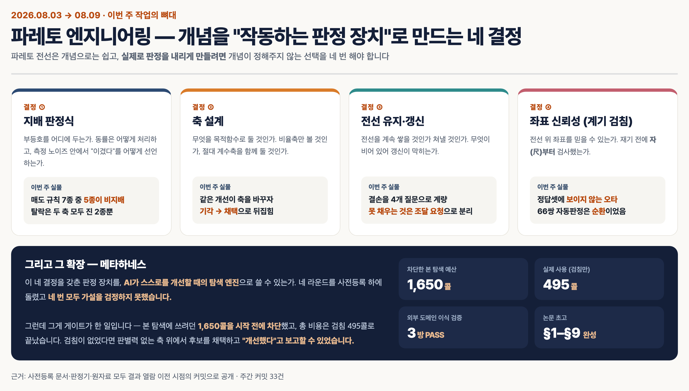
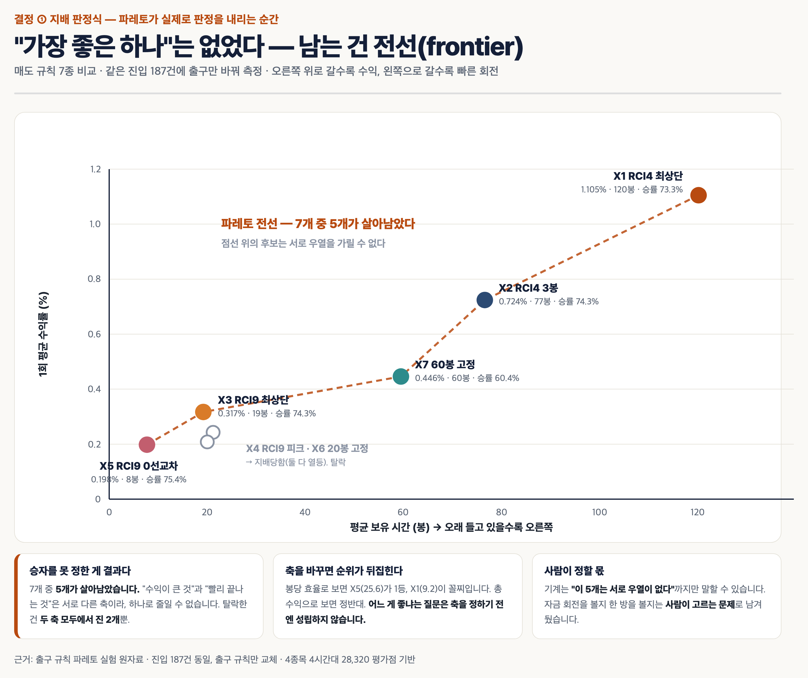
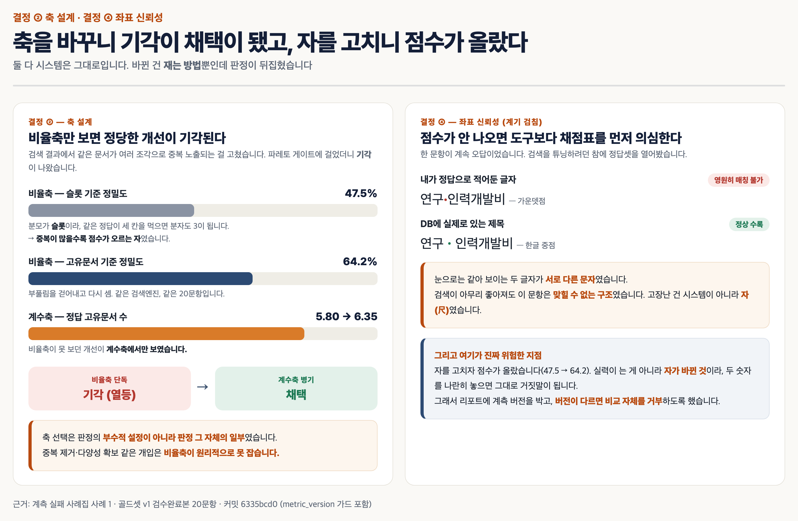
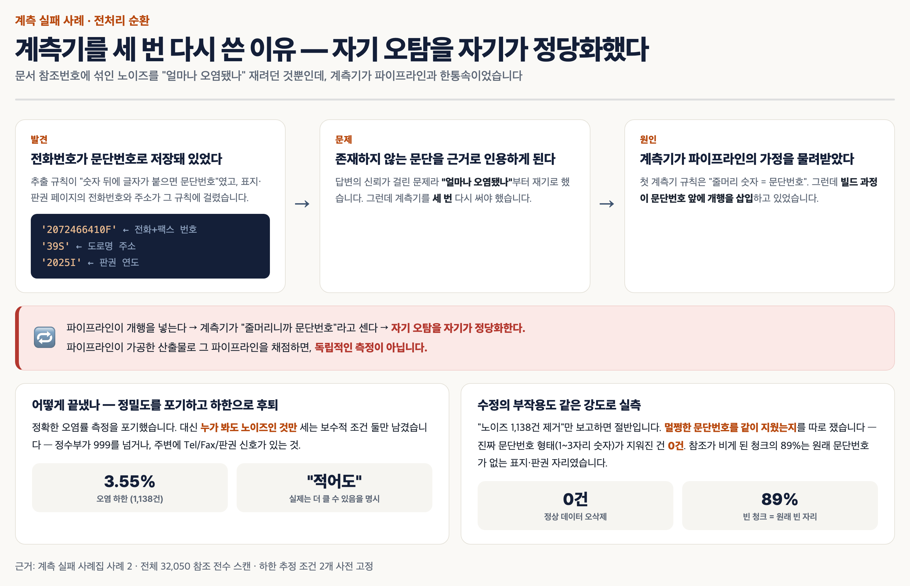
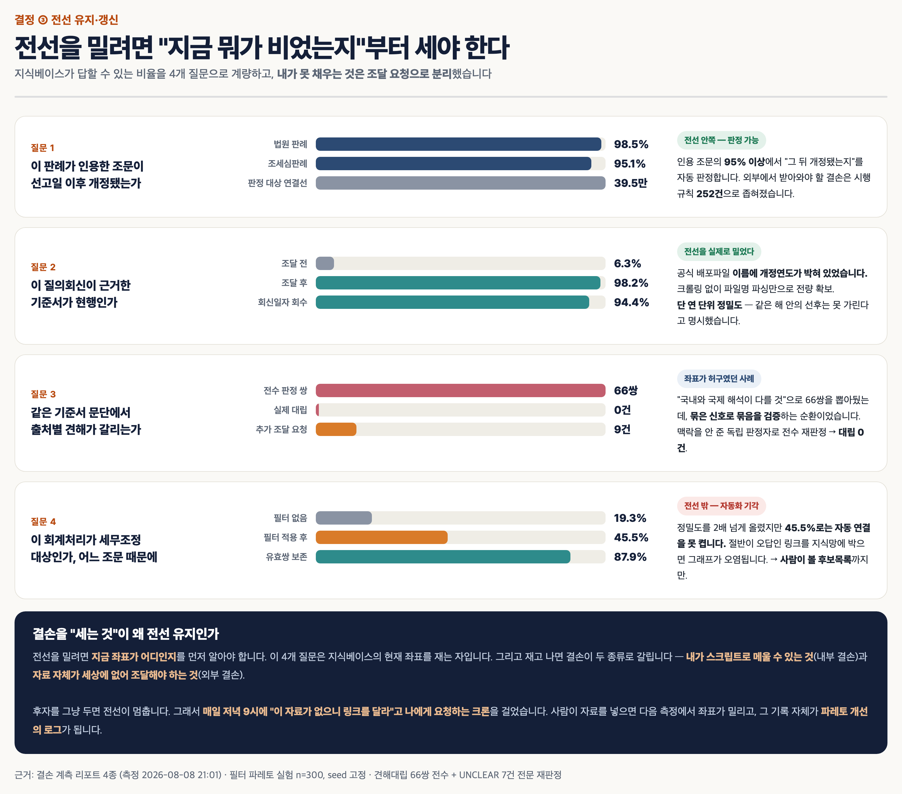
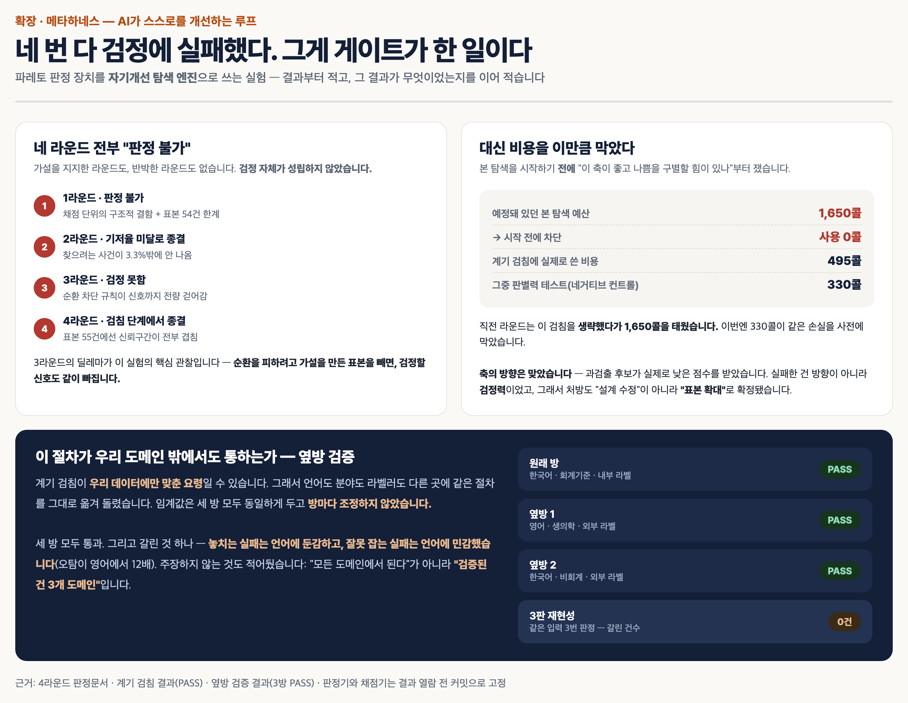
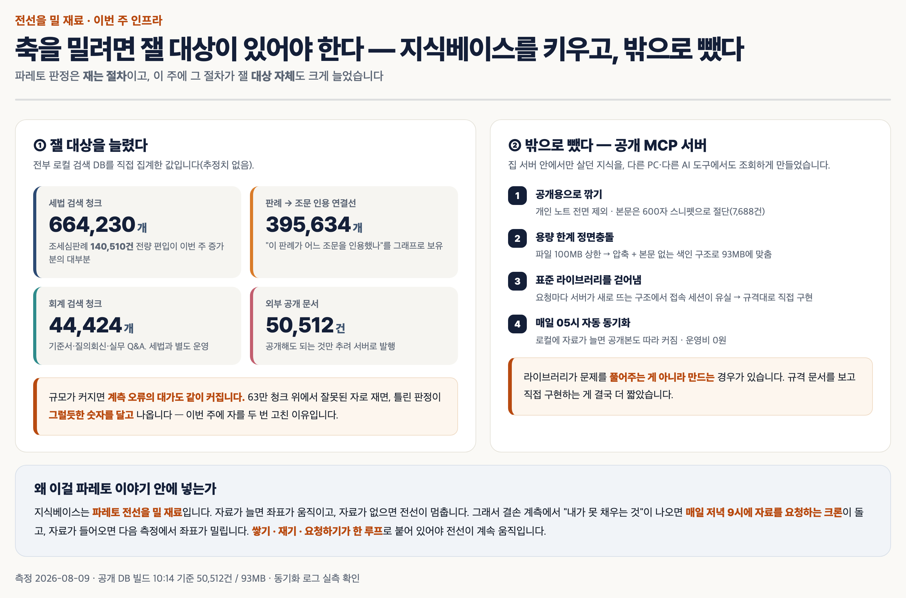
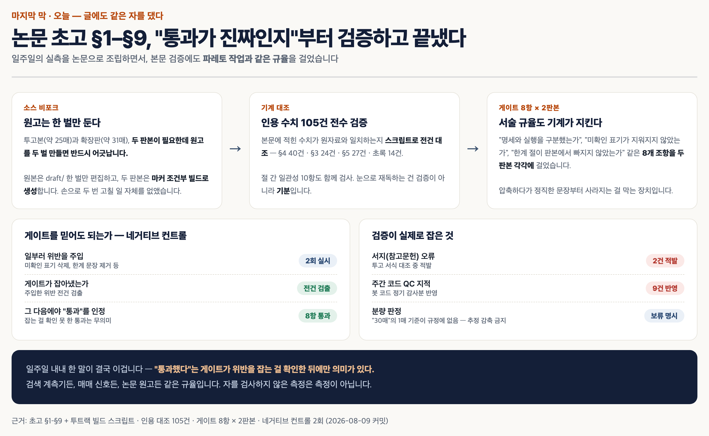

# FIELD REPORT — 자(尺)가 세 번 고장났다: 파레토 게이트 일주일 실전 운영기

> 이 문서는 본 레포의 게이트·계측 규율을 **실전 데이터에 일주일간 굴린 운영 기록**입니다.
> `gate/MEASUREMENT_FAILURES.md`(계측 실패 사례집)의 세 사례를 발생 순서·맥락과 함께
> 내러티브로 풀었고, 결손 계측·메타하네스 4라운드·옆방 검증까지 한 주의 전체 흐름을 담았습니다.
> 판정·수치의 정본은 `gate/` 아래 각 문서이며, 이 문서는 그 정본들의 **읽기용 종합판**입니다.

## 📝 한 줄 요약 (바쁘면 이것만)

이번 주 내내 한 가지를 만들었습니다. **"좋아졌는지"를 기계가 판정하게 만드는 장치.**

파레토 전선(frontier)이라는 개념은 쉽습니다. 상충하는 두 지표를 동시에 놓고 "이건 저것보다 확실히 낫다"를 가리는 것. 그런데 실제로 코드로 판정을 내리게 만들려니, **개념이 정해주지 않는 선택을 네 번 해야 했습니다.**

부등호를 어디에 둘지, 무엇을 축으로 삼을지, 전선을 어떻게 갱신할지, 그리고 **그 좌표를 믿어도 되는지.**

이 네 가지가 이 레포가 정의하는 **파레토 엔지니어링**입니다(정의·설계 = `gate/PARETO_META_HARNESS_DESIGN.md`). 선언과 계기 검침(V6 종결)이 앞선 라운드였다면, 이 문서는 그 장치로 **실전 데이터를 일주일 돌린 운영기**고 — 네 개 전부에서 사고가 났습니다.

- 축을 하나 더 얹었더니 **기각당한 개선이 채택으로 뒤집혔고**
- 자를 고쳤더니 **점수가 저절로 17%p 올라서** 오히려 비교를 금지해야 했고
- 자동으로 뽑아둔 "견해 대립 66건"은 **묶은 신호로 묶음을 검증하는 순환**이라 실제로는 0건이었고
- 이걸 AI 자기개선 루프에 붙이는 실험은 **네 라운드 전부 검정에 실패**했습니다.

마지막 게 제일 중요합니다. **네 번 실패한 것이 이 장치가 한 일**입니다. 검침이 없었다면 판별력 없는 자 위에서 후보를 고르고 "개선했다"고 보고했을 테니까요.



## 🎯 이런 분께 추천해요

- 개선 작업을 했는데 **지표가 오히려 나빠져서** 당황해 본 적 있는 분
- AI에게 뭔가 시켜놓고 **"이게 정말 좋아진 건지" 확인할 방법**이 없어 답답한 분
- "A안이 나아요, B안이 나아요"를 놓고 **끝없이 도는 회의**를 해본 분
- 숫자가 안 예쁠 때 **채점 기준을 고쳐도 되는지**의 경계선이 궁금한 분
- AI가 스스로를 개선하는 루프(자기개선 하네스)를 만들어보려는 분

## 😫 문제 상황 (Before)

저는 회계·세무 지식을 다루는 AI 봇들을 굴리고 있습니다. 매주 뭔가를 고칩니다. 검색을 손보고, 자료를 넣고, 프롬프트를 바꿉니다.

그런데 몇 달째 같은 지점에서 막혀 있었습니다.

> **"이번 수정, 좋아진 거 맞아?"**

이 질문에 제대로 답한 적이 거의 없었습니다. 보통 이렇게 됩니다.

- 정확도가 올랐는데 답변이 길어졌다 → **좋아진 건가?**
- 검색을 넓혔더니 정답은 더 찾는데 쓰레기도 늘었다 → **좋아진 건가?**
- 중복을 없앴더니 점수가 내려갔다 → **그럼 중복이 좋은 건가?**

이게 다 **하나의 숫자로 줄일 수 없는 문제**입니다. 그래서 결국 "느낌상 나아진 것 같다"로 끝나고, 다음 주에 같은 논쟁을 반복합니다.

파레토 전선이 이 문제의 정답이라는 건 알고 있었습니다. **여러 축을 동시에 보고, 모든 축에서 진 것만 탈락시키고, 나머지는 "서로 우열 없음"으로 남겨두는 것.** 개념은 대학교 1학년 수준입니다.

문제는 개념을 안다고 코드가 써지지 않는다는 거였습니다.

## 🛠️ 사용한 도구

- **AI 에이전트** — 메신저로 지시하면 로컬 PC에서 코드 짜고 실험 돌리고 커밋까지
- **로컬 지식베이스** — 회계·세법 문서를 검색 가능한 형태로 쌓아둔 것
- **파레토 게이트 스크립트** — 이번 주에 만든 판정 장치 본체
- **사전등록(pre-registration) 문서** — 실험하기 **전에** 판정 기준을 커밋으로 박아두는 절차

마지막 게 이 작업의 핵심 장치입니다. 나중에 설명하겠습니다.

---

## 🔧 작업 과정 — 네 결정, 네 사고

### 1막. 결정 ① 지배 판정식 — "이겼다"를 어떻게 선언할 것인가

먼저 판정식부터 정해야 했습니다.

```
Δ축A ≥ 0  그리고  Δ축B ≥ 0  그리고  둘 중 하나는 > 0
```

한국어로 옮기면 **"어느 축에서도 지지 않았고, 최소한 한 축에서는 이겼다"**입니다. 이걸 만족하면 채택, 아니면 기각.

이 식이 실제로 어떻게 작동하는지 보여주는 실험을 하나 했습니다. 매매 신호의 **매도 규칙 7종**을 같은 조건(진입 187건 동일)에 걸고, 두 축으로 놓고 비교했습니다. 하나는 **한 번에 버는 수익**, 하나는 **얼마나 빨리 끝나는가(자금 회전)**.



결과가 재미있었습니다. **7개 중 5개가 살아남았습니다.**

탈락한 건 두 축 모두에서 진 2개뿐. 나머지 5개는 서로 **우열을 가릴 수 없다**는 게 판정이었습니다. X1은 한 번에 1.105% 벌지만 120봉을 들고 있어야 하고, X5는 0.198%밖에 못 벌지만 8봉 만에 끝납니다. 어느 게 낫냐고요? **축을 정하기 전엔 그 질문 자체가 성립하지 않습니다.**

이게 제가 원하던 겁니다. 기계가 **"이 5개는 우열이 없다"**까지만 말하고, 자금 회전을 볼지 한 방을 볼지는 **사람이 고르게** 남기는 것.

덧붙이면, 출구만이 아니라 **진입 신호도 같은 규율**로 걸렀습니다. 4개 지표가 동시에 바닥권에 모이면 사는 신호는 발생 617회에 승률 62.1% — 아무 때나 산 기준선(51.5%)보다 **+10.6%p, 신뢰구간이 0을 포함하지 않아 채택**. 반대로 같은 지표의 매도 신호는 +0.4%p로 신뢰구간이 0을 걸쳐서 **보류**. "느낌상 좋다"가 아니라 발생 횟수·기준선 대비·신뢰구간 세 개를 통과한 것만 살렸습니다. 진입-보유-청산을 끝까지 이어 붙인 시뮬레이션(92회)도 승률 70.7%로 기준선 54.4%를 신뢰구간 밖에서 이겼습니다.

### 2막. 결정 ② 축 설계 — 축을 하나 더 얹자 기각이 채택이 됐다

여기서 제대로 걸렸습니다.

검색 결과에서 **같은 문서가 여러 조각으로 중복 노출**되는 문제가 있었습니다. 같은 판례가 3칸을 차지하면 사용자는 사실상 8건만 보는 셈이죠. 이걸 고쳤습니다. 그리고 파레토 게이트에 걸었더니 —

**기각.** 열등하다고 나왔습니다.

이상해서 계측기를 열어봤습니다. 정밀도 계산식이 이랬습니다.

```
정밀도 = 맞은 결과 수 ÷ 반환한 칸 수
```

**분모가 "칸"이었습니다.** 같은 정답 문서가 세 칸을 차지하면 분자도 3이 됩니다. 즉 —

> **중복이 많을수록 점수가 올라가는 자였습니다.**

중복을 없애는 개선이 기각당한 게 당연했습니다. 자가 중복을 보상하고 있었으니까요.



여기서 배운 게 이번 주 최고 수확입니다.

> **비율축은 중복 제거나 다양성 확보 같은 개입을 원리적으로 못 봅니다.**
> 분자와 분모가 같이 줄어드니까요. **절대 계수축**(정답 문서를 몇 개나 물어왔나)을 함께 놓아야 보입니다.

계수축을 얹자 같은 변경이 **5.80 → 6.35**로 개선이 보였고, 판정이 **기각에서 채택으로 뒤집혔습니다.**

축 선택은 판정의 부수적 설정이 아니었습니다. **축 선택이 곧 판정이었습니다.**

### 3막. 결정 ④ 좌표 신뢰성 — 자가 고장나 있었다 (세 번)

축을 고쳤으니 이제 제대로 잴 차례. 그런데 한 문항이 계속 틀렸습니다. 검색을 튜닝하려다가, 혹시나 해서 **정답셋**을 열어봤습니다.

```
내가 정답으로 적어둔 것 : 연구·인력개발비    ← 가운뎃점
DB에 실제로 있는 제목    : 연구ㆍ인력개발비    ← 한글 중점
```

**눈으로는 똑같습니다. 컴퓨터에겐 완전히 다른 글자입니다.**

이 문항은 검색이 아무리 좋아져도 **영원히 오답**이 될 운명이었습니다. 고장난 건 시스템이 아니라 **채점표**였습니다.

그리고 여기가 진짜 위험한 지점입니다. 자를 고치자 **점수가 47.5% → 64.2%로 올랐습니다.** 실력이 는 게 아니라 자가 바뀐 겁니다. 두 숫자를 나란히 놓고 "개선했다"고 쓰면 **그대로 거짓말**이 됩니다.

그래서 리포트에 계측 버전을 박고, **버전이 다르면 비교 자체를 거부**하도록 만들었습니다. 조용히 틀리는 것보다 비교를 거부하는 게 낫습니다.

**두 번째 고장은 계측기가 파이프라인과 한통속인 경우였습니다.**

답변 근거로 붙는 문서 참조번호에 노이즈가 섞여 있었습니다. 추출 규칙이 "숫자 뒤에 글자가 붙으면 문단번호"였는데, 이 규칙에 표지·판권 페이지의 **전화번호와 주소**가 걸렸습니다.

```
'2072466410F'  ← 전화+팩스 번호가 문단번호로 저장됨
'39S'          ← 도로명 주소
'2025I'        ← 판권 연도
```

이대로면 봇이 **존재하지 않는 문단을 근거로 인용**하게 됩니다. 문제는 명확했으니 "얼마나 오염됐나"부터 재려 했습니다. 그런데 계측기를 **세 번** 다시 써야 했습니다.

첫 계측기의 규칙은 "줄머리에 오는 숫자를 문단번호로 본다"였습니다. 그런데 알고 보니 **빌드 과정이 문단번호 앞에 개행을 삽입**하고 있었습니다. 그러면 이렇게 됩니다 —

> 파이프라인이 개행을 넣는다 → 계측기가 "줄머리니까 문단번호"라고 센다 → **자기 오탐을 자기가 정당화한다.**

파이프라인이 가공한 산출물로 그 파이프라인을 채점하면, 계측기는 파이프라인의 가정을 그대로 물려받습니다. 독립적인 측정이 아닙니다.

결국 정확한 오염률 측정을 **포기**했습니다. 대신 누가 봐도 노이즈인 것만 세는 보수적 조건 둘(정수부 999 초과, 주변에 Tel/Fax/판권 신호)만 남겨 **하한 추정으로 후퇴**했습니다 — 전체 32,050건 중 1,138건(3.55%), 그리고 "적어도 이만큼이며 실제는 더 클 수 있다"고 명시했습니다. 방어할 수 없는 정밀한 수치보다 **방어 가능한 느슨한 수치**가 낫습니다.

한 가지 더 — 수정의 **부작용도 같은 강도로** 쟀습니다. "노이즈 1,138건 제거"만 보고하면 절반입니다. 멀쩡한 문단번호를 같이 지웠는지 따로 재보니 **0건**, 참조가 비게 된 청크의 89%는 원래 문단번호가 없는 표지·판권 자리였습니다. 이 두 숫자가 같이 있어야 판정이 됩니다.



**세 번째 고장이 제일 교묘했습니다.**

"국내 해석과 국제 해석이 갈리는 쟁점"을 자동으로 66쌍 뽑아둔 게 있었습니다. 봇이 답변할 때 "이 쟁점은 견해가 갈립니다"라고 경고하는 데 쓰고 있었죠.

검증하려다 순환을 발견했습니다.

> 후보를 묶은 건 **유사도 신호**인데, 그 신호로 "정말 대립하는가"를 판정하면
> **묶은 이유가 곧 판정 근거**가 됩니다. 아무것도 검증되지 않습니다.

끊는 방법은 하나였습니다. **맥락을 일절 주지 않는 독립 판정자**를 세우는 것. 클러스터 정보도, 유사도 점수도 안 주고, 두 문서 본문만 던져서 "결론이 실제로 다른가"만 묻게 했습니다.

**66쌍 전수 판정 → 대립 0건.** 1차에서 애매했던 7건은 본문이 잘려서 그랬던 거라, 전문으로 다시 던져 전건 해소했습니다.

"견해 대립 66쌍"은 **실재하지 않았습니다.** 봇의 경고 문구를 그에 맞게 내렸습니다.

다만 마지막에 반전이 있었습니다. 전수 판정 중 한 건에서, 형식논리상 충돌은 아니지만 실무적으로는 한쪽만 보면 위험한 사례가 나왔습니다. **"대립 0건"과 "한쪽만 봐도 된다"는 다른 명제**입니다. 이걸 각주로 남겼습니다.

### 4막. 결정 ③ 전선 유지 — 밀려면 지금 좌표를 알아야 한다

판정식도 있고 축도 있고 자도 고쳤습니다. 이제 **전선을 실제로 밀** 차례입니다.

그런데 밀려면 **지금 어디 서 있는지**를 알아야 합니다. 그래서 지식베이스에 질문 4개를 던지고, 각 질문에 답할 수 있는 비율을 쟀습니다.



재고 나니 결손이 **두 종류**로 갈렸습니다.

- **내부 결손** — 내가 스크립트 돌리면 메울 수 있는 것
- **외부 결손** — 자료 자체가 내 손에 없어서, **밖에서 받아와야** 하는 것

전자는 그냥 하면 됩니다. 문제는 후자입니다. 그냥 두면 **전선이 거기서 멈춥니다.**

그래서 이렇게 했습니다.

> **매일 저녁 9시, AI가 저에게 "이 자료가 없으니 링크를 달라"고 요청하는 자동 알림**을 걸었습니다. 하루 2건씩, 주말 포함. 중복 요청은 알아서 걸러내게 했습니다.

요청은 이렇게 옵니다 — "○○ 시행규칙 56조의 개정 연혁이 없어서 판례 169건의 현행성 판정이 막혀 있습니다. 공식 사이트의 이 페이지 링크를 주시면 해소됩니다." **무엇이, 몇 건을, 왜 막고 있는지**가 함께 오니까 제가 5분만 투자하면 됩니다.

제가 자료를 넣으면 다음 측정에서 좌표가 밀립니다. 그리고 **그 기록 자체가 파레토 개선의 로그**가 됩니다. 사람과 기계가 각자 할 수 있는 걸 나눠 맡는 구조입니다.

한 가지 성공 사례가 있었습니다. 질문 2번은 커버리지가 **6.3%**밖에 안 됐는데, 알고 보니 필요한 정보가 **공식 배포 파일 이름에 이미 박혀 있었습니다.** 크롤링도 API도 필요 없이 파일명만 파싱해서 **98.2%**로 올렸습니다. 하루 만에 끝났습니다.

반대로 질문 4번은 **기각**했습니다. 필터로 정밀도를 19.3% → 45.5%까지 올렸지만, 그래도 자동 연결은 안 켰습니다. **절반이 오답인 링크를 지식망에 박으면 그래프 전체가 오염**되니까요. 사람이 검토할 후보목록까지만 냈습니다.

---

## 🧪 그리고 확장 — 이걸 AI 자기개선 루프에 붙여봤다

여기까지가 **파레토 엔지니어링**입니다. 판정을 내리는 장치.

다음 질문은 자연스럽습니다.

> **이 장치를 AI가 스스로를 개선할 때의 "탐색 엔진"으로 쓸 수 있을까?**

AI가 자기 프롬프트 후보를 여러 개 만들고, 파레토 전선 위에 올려놓고, 전선 위 후보들을 부모로 삼아 다음 세대를 만드는 구조. 이걸 **메타하네스**라고 부릅니다.

네 라운드를 돌렸습니다. 그리고 **네 번 다 가설을 검정하지 못했습니다.** (판정 정본: `gate/PHASE1_VERDICT.md` `PHASE2_VERDICT.md` `PHASE3_VERDICT.md` `PARETO_MH_VERDICT.md` — 이 절은 네 라운드를 한 장에 놓고 옆방 검증까지 잇는 종합입니다.)



솔직히 적겠습니다. 지지한 라운드도, 반박한 라운드도 없습니다. **검정 자체가 성립하지 않았습니다.**

- 1라운드 — 채점 단위에 구조적 결함, 표본 54건 한계
- 2라운드 — 찾으려는 사건이 3.3%밖에 안 나옴 (기저율 미달)
- 3라운드 — **순환을 피하려고 가설 만든 표본을 뺐더니, 검정할 신호도 같이 빠짐**
- 4라운드 — 표본 55건에선 신뢰구간이 전부 겹쳐서 어느 후보도 구별 안 됨

3라운드의 딜레마가 이 실험의 핵심 관찰입니다.

> **"관찰해서 세운 가설을 그 데이터로 검정"하면 순환입니다.**
> 그래서 그 표본을 제외했더니, **문제 사례가 하나도 안 남았습니다.**
> 규율을 성실히 지킨 결과가 검정 불가였습니다.

### 그런데 이게 실패담이 아닌 이유

4라운드에서 저는 본 탐색을 **시작하기 전에** 이걸 먼저 쟀습니다.

> **"이 축이 좋은 후보와 나쁜 후보를 구별할 힘이 있나?"**

일부러 나쁘게 만든 후보를 넣고, 축이 그걸 벌하는지 봤습니다. 330콜 썼습니다. 결과는 **FAIL** — 방향은 맞았는데(나쁜 후보가 실제로 낮은 점수를 받음) **신뢰구간이 겹쳐서** 구별이 안 됐습니다.

그래서 본 탐색을 **시작하지 않고 종결**했습니다.

- 예정돼 있던 본 탐색 예산: **1,650콜**
- 실제 사용: **495콜** (검침만)

직전 라운드는 이 검침을 **생략했다가 1,650콜을 그대로 태웠습니다.** 이번엔 330콜이 같은 손실을 막았습니다.

검침이 **제 진단을 기각한 적도 있습니다.** 3라운드가 문제 판정 0건으로 끝났을 때, 저는 코드를 대조해보고 "판정기가 고장났다"는 가설을 유력하게 봤습니다. 근거도 실재했습니다 — 판정기에 있어야 할 지침 두 개가 빠져 있었거든요. 그런데 검침을 돌려보니 그 판정기는 사람이 문제로 표시한 11건 중 **9건을 잡았습니다(회수율 81.8%).** 지침이 빠졌어도 검출력은 멀쩡했던 겁니다. 검침 없이 진단대로 "고쳤다면", **멀쩡한 도구를 고치고 그 변경을 개선이라고 보고할 뻔했습니다.** 코드 대조는 그럴듯한 가설을 주지만, 판정이 아닙니다.

그리고 처방도 달라졌습니다. FAIL의 원인이 "설계가 틀렸다"가 아니라 **"표본이 작다"**로 특정됐으니, 다음에 할 일은 설계 수정이 아니라 **라벨 표본 확대**입니다. 이게 검침의 진짜 효용입니다 — **뭘 고쳐야 하는지를 알려주는 것.**

### 이 절차가 우리 데이터에만 맞춘 요령은 아닐까

당연히 의심스러웠습니다. 그래서 **언어도, 분야도, 라벨을 단 사람도 다른** 데이터셋 두 개에 같은 절차를 그대로 옮겨 돌렸습니다. **임계값은 세 곳 모두 동일하게 두고, 방마다 조정하지 않았습니다.**

세 곳 모두 통과했습니다. 그리고 흥미로운 게 하나 갈렸습니다.

> **놓치는 실패는 언어에 둔감하고, 잘못 잡는 실패는 언어에 민감했습니다.**
> 문제를 못 찾는 경우는 두 언어에서 모두 0인데, 문제가 아닌 걸 문제라고 하는 오탐은 **영어에서 12배** 늘었습니다.

주장하지 않는 것도 적어뒀습니다. "모든 도메인에서 된다"가 아니라 **"검증된 건 3개 도메인"**입니다.

---

## 🏗️ 잴 대상도 같이 키웠다

판정 장치만 있으면 소용없습니다. **잴 대상**이 있어야죠. 그래서 지식베이스도 이번 주에 크게 늘렸습니다.



그리고 이걸 **밖으로 뺐습니다.** 집 서버 안에서만 살던 지식을, 다른 PC나 다른 AI 도구에서도 조회할 수 있는 **공개 서버**로 발행했습니다. 운영비는 0원이고, 매일 새벽 자동으로 갱신됩니다.

여기서도 삽질이 있었습니다. 표준 라이브러리를 그대로 쓰니 **요청마다 서버가 새로 뜨는 환경에서 접속 세션이 유실**됐습니다. 결국 라이브러리를 걷어내고 규격대로 직접 구현했습니다. **라이브러리가 문제를 풀어주는 게 아니라 만드는 경우**가 있습니다.

왜 이 얘기를 파레토 글에 넣냐면 — **쌓기·재기·요청하기가 한 루프로 붙어 있어야 전선이 계속 움직이기 때문**입니다. 자료가 늘면 좌표가 움직이고, 결손 계측이 부족한 걸 짚으면 크론이 저에게 자료를 요청하고, 자료가 들어오면 다음 측정에서 좌표가 또 밀립니다.

---

## 📄 마지막 막 · 오늘 — 글에도 같은 자를 댔다

일주일의 실측이 쌓이자, 이걸 정식 논문으로 조립하는 작업을 오늘 마쳤습니다. §1부터 §9까지 전 절 초고 완성. 그런데 여기서도 **본문 검증에 파레토 작업과 똑같은 규율**을 걸었습니다.

**원고는 한 벌만 둡니다.** 투고본(약 25매)과 확장판(약 31매) 두 판본이 필요한데, 원고를 두 벌 만들면 반드시 어긋납니다. 원본 한 벌만 편집하고 두 판본은 **마커 조건부 빌드로 생성** — 손으로 두 번 고칠 일 자체를 없앴습니다.

**수치는 기계가 대조합니다.** 본문에 적힌 인용 수치가 원자료와 일치하는지 스크립트로 전건 대조했습니다 — §4 40건, §3 24건, §5 27건, 초록 14건, 합계 **105건**. 절 간 일관성 10항도 함께. 눈으로 재독하는 건 검증이 아니라 기분입니다.

**서술 규율도 기계가 지킵니다.** "명세와 실행을 구분했는가", "미확인 표기가 지워지지 않았는가", "한계 절이 빠지지 않았는가" 같은 **8개 조항을 두 판본 각각에** 걸었습니다. 판본을 압축하다 보면 정직한 문장부터 사라지거든요.

그리고 이 글의 주제답게 — **게이트 자체를 먼저 시험했습니다.** 일부러 위반을 주입하고(미확인 표기 삭제 등) 게이트가 잡아내는지 **2회 확인, 전건 검출.** 그 다음에야 "8항 통과"를 인정했습니다. 잡는 걸 확인 못 한 통과는 무의미하니까요.

검증이 실제로 잡은 것도 있습니다 — 투고 서식 대조 중 **서지 오류 2건** 적발, 주간 코드 QC에서 올라온 **지적 9건** 반영. 반대로 판정을 **보류**한 것도 남겼습니다: 투고 규정의 "30매"가 A4 기준인지 원고지 기준인지 규정에 없어서, 기준이 확인될 때까지 **추정으로 감축하지 않기로** 했습니다. 가정 위에서 자르면 판정이 뒤집힐 수 있으니까요.



일주일 내내 한 말이 결국 이겁니다.

> **"통과했다"는 게이트가 위반을 잡는 걸 확인한 뒤에만 의미가 있다.**
> 검색 계측기든, 매매 신호든, 논문 원고든 같은 규율입니다. 자를 검사하지 않은 측정은 측정이 아닙니다.

---

## ✅ 결과 (Before / After)

| | Before (운영 전) | After (운영 1주 후) |
|---|---|---|
| **"좋아졌나?" 판정** | 느낌으로 판단, 매주 같은 논쟁 반복 | 두 축 놓고 기계가 판정. 우열 없으면 **"우열 없음"으로 남김** |
| **축 설계** | 정밀도 하나만 봄 | **비율축 + 계수축 병기.** 중복 제거 개선이 비로소 보임 |
| **계측기 신뢰** | 의심해본 적 없음 | 정답셋 오타·전처리 순환·판정 순환 **세 건 적발**, 버전 다르면 비교 거부 |
| **결손 관리** | "뭐가 부족한지" 감으로만 앎 | 4개 질문으로 계량, **외부 조달분은 매일 21시 자동 요청** |
| **탐색 비용** | 검침 없이 돌려 1,650콜 소진 전례 | **330콜 검침이 1,650콜을 시작 전 차단** |
| **자기개선 루프** | 막연히 "되겠지" | **네 라운드 전부 판정 불가**를 정직하게 보고 + 원인 특정 |
| **외부 이식성** | 미검증 | **3개 도메인 통과**(언어·분야·라벨러 전부 다름) |
| **논문** | 목차와 메모 | **§1–§9 전 절 초고 + 인용 105건 기계 대조 + 게이트 8항×2판본** |

가장 큰 변화는 숫자가 아닙니다.

> **"개선했다"고 보고할 수 있었던 상황이 이번 주에만 세 번 있었고, 세 번 다 틀렸습니다.**
>
> 중복 제거는 기각을 그대로 받아들이면 끝났고, 정답셋 오타는 검색 탓으로 돌리면 됐고, 견해 대립 66건은 성과로 발표하면 됐습니다. 계측기를 의심하는 데 든 비용이 개선 자체보다 컸는데, **세 번 다 그 비용이 정당했습니다.**

## 💬 배운 것

**효과적이었던 것**

1. **판정 기준을 실험 전에 커밋으로 박아두기.** 결과를 보고 기준을 조정하면 무슨 짓을 해도 성공합니다. 커밋 해시가 순서를 증명해줍니다.
2. **본 실험 전에 "자부터 검사"하기.** 일부러 나쁜 후보를 넣고 축이 벌하는지 보는 것. 330콜로 1,650콜을 막았습니다.
3. **비율축 옆에 계수축 병기.** 이거 하나로 판정이 뒤집혔습니다.
4. **판정자에게 맥락을 주지 않기.** 순환을 끊는 유일한 방법이었습니다.
5. **못 채우는 결손을 사람에게 요청하는 자동화.** AI가 못 하는 걸 인정하고 사람에게 넘기는 게 오히려 루프를 돌게 만듭니다.

**하지 말아야 할 것**

1. **점수 안 나온다고 도구부터 튜닝하기.** 채점표를 먼저 여세요. 이번 주에 두 번 다 채점표가 범인이었습니다.
2. **자를 바꾼 뒤 이전 숫자와 비교하기.** 그건 개선이 아니라 자의 변경입니다. 비교를 거부하는 게 정직합니다.
3. **"검정 못 함"을 "효과 없음"으로 쓰기.** 완전히 다른 말입니다. 표본이 작아서 못 잰 걸 "효과 없다"고 쓰면 다음 사람이 그 방향을 포기합니다.
4. **파이프라인이 만든 산출물로 그 파이프라인 채점하기.** 계측기가 파이프라인의 가정을 그대로 물려받습니다.
5. **0건 판정을 결론으로 쓰기.** 무엇을 0으로 셌는지, 그 0이 무엇을 함의하지 *않는지*를 같이 적어야 합니다.

## 🌍 다른 업무에도 쓸 수 있어요

이 구조는 AI나 검색에만 쓰이는 게 아닙니다. **상충하는 지표가 두 개 이상 있는 모든 결정**에 그대로 붙습니다.

- **채용** — 경력 연차 ↔ 인건비. 둘 다 열등한 후보만 걸러내고, 나머지는 "우열 없음"으로 남겨 사람이 고르기
- **거래처 선정** — 단가 ↔ 납기. 한 축으로 줄이려다 매번 싸우는 그 회의
- **마케팅** — 도달 ↔ 전환율. "이 캠페인이 나은가"를 하나의 숫자로 못 줄일 때
- **업무 자동화** — 자동화 정확도 ↔ 검토 부담. 정확도 45%짜리 자동화를 켜면 안 되는 이유

핵심은 하나입니다. **"제일 좋은 하나"를 억지로 뽑지 않는 것.** 기계는 "이것들은 우열이 없다"까지만 말하게 하고, 트레이드오프를 선택하는 건 사람 몫으로 남깁니다.

## 🧰 따라 해보기 — 내 자동화에 들이댈 "판정 질문 4개"

제 인프라가 없어도 됩니다. 지금 운영 중인 자동화·스킬·업무 절차 아무거나 하나 골라서, 이 네 질문을 그대로 대보세요. 저는 이번 주에 네 개 전부에서 구멍이 나왔습니다.

| # | 판정 질문 | 구멍이면 이런 증상 |
|---|---|---|
| ① | **"이겼다"의 기준이 글로 적혀 있는가?** 부등호·동률 처리까지 | 회의 때마다 "그래도 이게 낫지 않나"가 반복됨 |
| ② | **지표가 비율 하나뿐인가?** 절대 개수 축이 같이 있는가 | 중복 제거·정리 작업을 하면 지표가 오히려 나빠짐 |
| ③ | **"뭐가 부족한지"를 세어봤는가?** 내가 못 채우는 건 누구에게 요청되는가 | 개선이 어느 순간 멈췄는데 이유를 말로 못 함 |
| ④ | **채점표를 의심해본 적 있는가?** 정답셋·판정 신호가 채점 대상과 독립인가 | 점수가 이상하면 항상 도구부터 튜닝하고 있음 |

④에서 하나라도 "아니오"면, 지금 보고 있는 그 지표는 **틀린 채로 그럴듯할** 가능성이 있습니다.

## ⚠️ 한계 — 이 글이 주장하지 않는 것

정직하게 선을 긋습니다.

- **"파레토 기반 탐색이 성능을 올린다"는 주장이 아닙니다.** 네 라운드 모두 그 검정에 실패했습니다. 이 글이 다루는 건 **그 주장이 검정 가능해지기 위한 구현 조건**까지입니다.
- **외부 이식성은 3개 도메인까지만 확인**됐습니다. "모든 도메인에서 된다"가 아닙니다.
- **결손 계측 일부는 연 단위 정밀도**입니다. 같은 해 안의 선후는 못 가립니다.
- **판정자 모델은 1종**만 썼습니다. 모델을 바꿔도 같은 결과인지는 미검증입니다.
- 견해대립 "0건"은 **한쪽만 봐도 된다는 뜻이 아닙니다.** 형식논리상 충돌이 아니어도 실무상 위험한 사례가 실제로 있었습니다.

## 🚀 앞으로

- **표본 확대 후 검침 재실행** — 4라운드 FAIL의 처방이 이걸로 특정됐습니다. 통과 전엔 본 탐색을 다시 열지 않습니다.
- **결손 조달 루프 관찰** — 매일 21시 요청이 실제로 좌표를 미는지, 몇 주치 로그를 쌓아서 볼 예정입니다.
- **논문 투고** — 초고는 오늘 끝났으니, 남은 건 분량 기준 확인과 투고 절차입니다. 여기도 추정 없이, 규정 실측부터.

## 📋 재사용 프롬프트

AI 에이전트에게 개선 작업을 시킬 때, 저는 요즘 이렇게 시작합니다.

> **"이 변경이 좋아진 건지 판정해줘. 단, 판정하기 전에 다음을 먼저 해:**
> **① 지표를 최소 2개 잡아라. 비율 지표 하나만 쓰지 말고, 절대 개수를 세는 지표를 반드시 하나 얹어라.**
> **② 채점 코드의 분모가 뭔지 열어서 확인하고 나한테 보고해라.**
> **③ 정답셋에 오타나 인코딩 불일치가 있는지 먼저 검사해라.**
> **④ 판정 기준을 결과 보기 전에 파일로 적고 커밋해라.**
> **그 다음에 재고, 두 지표 모두에서 지지 않았을 때만 채택이라고 말해. 우열을 못 가리겠으면 '우열 없음'이라고 답하고 나한테 선택지를 줘."**

계측기를 의심하는 절차를 지시에 박아두는 게 핵심입니다. 안 시키면 AI는 **주어진 자를 그대로 믿습니다.**

그리고 실험이 실패했을 때는 이렇게 되묻습니다.

> **"이게 '효과가 없다'인지 '검정을 못 했다'인지 구분해서 말해줘. 표본 크기와 신뢰구간을 근거로."**

이 한 줄이 "실패했으니 접자"와 "표본만 늘리면 된다"를 갈라줍니다.

---

*이번 주 작업은 커밋 33건, 검증 게이트 실측, 사전등록 문서로 전부 재현 가능한 상태로 남겼습니다. 숫자는 전부 실측값이고, 추정치는 넣지 않았습니다.*
